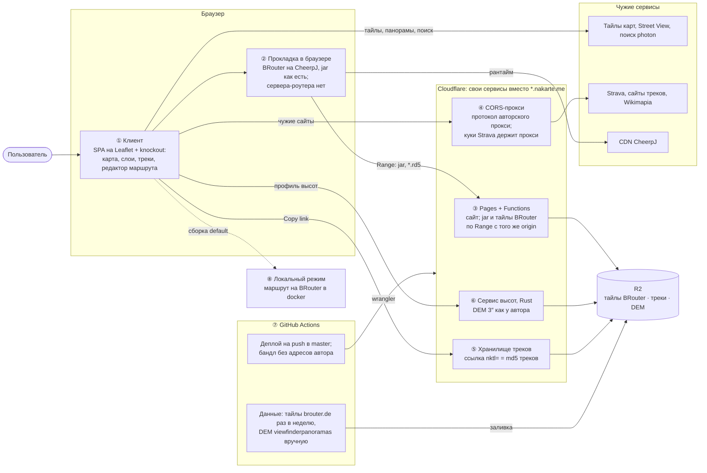
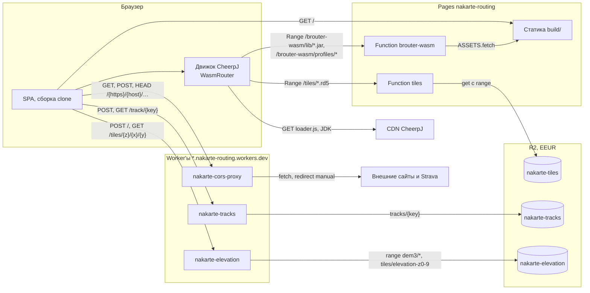
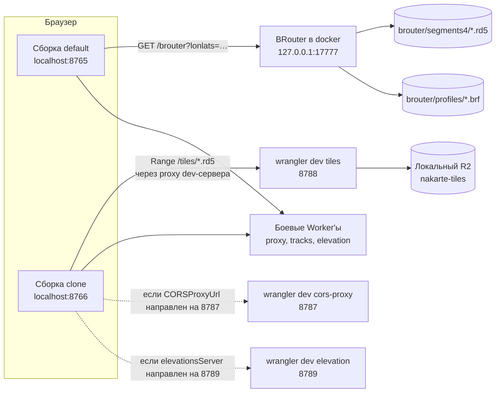

# Архитектура

Схема приложения сверху вниз: сначала общая картина крупными блоками с ключевыми решениями, потом каждый блок отдельно. Документ показывает структуру и связи, а остальное — ссылкой туда, где оно записано (`AGENTS.md`, раздел «Где что записано»): поведение — `openspec/specs/`, причины решений — архив changes и [реестр решений](decisions.md), запуск и подвохи — `AGENTS.md`, риски — `openspec/backlog.md`.

Диаграммы сверены с кодом на `master` 2026-10-08. Правишь связь в коде — правь стрелку здесь.

## Общая схема

Что есть в системе, где оно работает и какие решения определяют её форму. Номер блока ведёт в таблицу под схемой.

| Блок | Ключевое решение | Вглубь | Почему так |
|---|---|---|---|
| ① Клиент | SPA апстрима, адреса сервисов общие для всех сборок, сборка клона отличается только движком | [client.md](client.md), [route-editor.md](route-editor.md) | [реестр: платформа и стек](decisions.md#платформа-и-стек), [редактор](decisions.md#редактор) |
| ② Прокладка в браузере | маршрут считает BRouter на CheerpJ в странице; сервер только раздаёт файлы | [routing.md](routing.md) | [реестр: прокладка и движок](decisions.md#прокладка-и-движок-в-браузере) |
| ③ Pages + Functions | jar, профили и тайлы BRouter с origin клона по Range: CheerpJ читает только его | [routing.md](routing.md), [уровень 2](#публичный-клон) | [реестр: прокладка и движок](decisions.md#прокладка-и-движок-в-браузере) |
| ④ CORS-прокси | повторяет протокол авторского прокси; куки Strava heatmap прокси получает сам по сессии | [cors-proxy.md](cors-proxy.md) | [реестр: CORS-прокси и Strava](decisions.md#cors-прокси-и-strava) |
| ⑤ Хранилище треков | ссылка `nktl=` — md5 треков, объект в R2 неизменяемый | [track-storage.md](track-storage.md) | [реестр: хранилище треков](decisions.md#хранилище-треков) |
| ⑥ Сервис высот | данные и арифметика автора, Rust → wasm; тайлы z0–9 из архива, z10–11 на лету | [elevation.md](elevation.md) | [реестр: сервис высот](decisions.md#сервис-высот) |
| ⑦ GitHub Actions | прод = `master`; данные в R2 заливает CI, а не рантайм; деплой падает на адресах автора | [ci-cd.md](ci-cd.md), [protection.md](protection.md) | [реестр: деплой и защита](decisions.md#деплой-и-защита) |
| ⑧ Локальный режим | та же кодовая база, `routingEngine: 'server'` и BRouter в docker | [уровень 2](#локальный-режим), [routing.md](routing.md) | `AGENTS.md`, [«Запуск»](../../AGENTS.md#запуск) |
| Cloudflare целиком | свои Worker'ы и R2 вместо `*.nakarte.me`, с лимитами на вызов и частоту | [protection.md](protection.md), [что заменено](#что-больше-не-используется-от-nakarteme) | [реестр: платформа и стек](decisions.md#платформа-и-стек) |

От каких чужих сервисов зависит система и что ломается при отказе каждого — backlog, «Внешние зависимости и риски».

## Уровень 2: контейнеры и запросы

Блоки общей схемы на уровень ниже: каждый сервис и путь запроса с протоколом. Две картинки: публичный клон и локальный режим. Клиент один, сборок две; чем они отличаются — [client.md](client.md).

### Публичный клон

Сборка `NAKARTE_TARGET=clone` на `nakarte-routing.pages.dev`. Маршрут считается в браузере, тайлы BRouter и файлы движка идут с того же origin.

Ресурсы Cloudflare, аккаунт и адреса — `AGENTS.md`, [«Публичный клон на Cloudflare»](../../AGENTS.md#публичный-клон-на-cloudflare).

### Локальный режим

Сборка по умолчанию на 8765 с BRouter в docker и dev-сервер клона на 8766. Worker'ы локально нужны только для проверки изменений в них: dev-серверы по умолчанию ходят в боевые Worker'ы (адреса — [config.js](../../src/config.js)).

Сборка default считает в браузере, если `src/secrets.js` задаёт `routingEngine: 'browser'`: тогда тайлы идут с `routingTilesPath` по умолчанию, `/brouter-wasm/segments4/`, куда dev-сервер раздаёт `brouter/segments4/` ([webpack.config.js](../../webpack/webpack.config.js), `browserRouterStatic`). Запуск, порты и подвохи — `AGENTS.md`, [«Запуск»](../../AGENTS.md#запуск) и [«Публичный клон на Cloudflare»](../../AGENTS.md#публичный-клон-на-cloudflare).

## Что больше не используется от `*.nakarte.me`

Клон не ходит в инфраструктуру автора ни в одной функции (требование «Без запросов к инфраструктуре автора» в [clone-hosting](../../openspec/specs/clone-hosting/spec.md)), деплой проверяет это по бандлу ([protection.md](protection.md)).

| Сервис автора | Чем заменён | Источник |
|---|---|---|
| `proxy.nakarte.me` | `nakarte-cors-proxy` | [cors-proxy](../../openspec/specs/cors-proxy/spec.md), [drop-author-services](../../openspec/changes/archive/2026-10-08-drop-author-services/design.md) |
| `proxy.nakarte.me/mapy/` (слои mapy.cz) | удалены, не заменены | [drop-author-services](../../openspec/changes/archive/2026-10-08-drop-author-services/design.md) |
| `tracks.nakarte.me` | `nakarte-tracks` | [track-storage](../../openspec/specs/track-storage/spec.md) |
| `elevation.nakarte.me` | `nakarte-elevation`, `POST /` | [elevation-api](../../openspec/specs/elevation-api/spec.md) |
| `tiles.nakarte.me/elevation` | `nakarte-elevation`, `GET /tiles/{z}/{x}/{y}` | [elevation-tiles](../../openspec/specs/elevation-tiles/spec.md) |
| `{s}.tiles.nakarte.me`, `tiles.nakarte.me/topomapper` (сканы карт), `nakarte.me/westraPasses/`, `nakarte.me/geocachingSu/` | слои удалены | [drop-author-scan-layers](../../openspec/changes/archive/2026-10-08-drop-author-scan-layers/design.md) |
| `tiles.nakarte.me/wikimedia_commons_images`, `mapillary.nakarte.me` (покрытие панорам) | провайдеры удалены, остался Street View | [remove-panorama-providers](../../openspec/changes/archive/2026-10-08-remove-panorama-providers/design.md) |
| `nakarte.me/event`, Sentry | нет: `eventsLogUrl` и `sentryDSN` пустые | [config.js](../../src/config.js), [drop-author-services](../../openspec/changes/archive/2026-10-08-drop-author-services/design.md) |

## Инвентаризация

Каждый компонент и каждая связь — с файлом, по которому они сверены. Все диаграммы построены по этим таблицам; это справочник для сверки, а не для чтения подряд.

### Компоненты

| Компонент | Что это | Доказательство |
|---|---|---|
| Клиент | SPA на Leaflet + knockout, сборка webpack | [webpack.config.js](../../webpack/webpack.config.js), [App.js](../../src/App.js) |
| Сборка по умолчанию (серверный режим) | `NAKARTE_TARGET` не задан → `config-target/default.js`, маршрут на серверном BRouter | [webpack.config.js](../../webpack/webpack.config.js) (`configTarget`), [default.js](../../src/config-target/default.js) |
| Сборка клона | `NAKARTE_TARGET=clone` → `config-target/clone.js`, движок в браузере | [clone.js](../../src/config-target/clone.js), [deploy-pages.yml](../../.github/workflows/deploy-pages.yml) |
| Pages-проект `nakarte-routing` | статика `build/` и Pages Functions, адрес `nakarte-routing.pages.dev` | [wrangler.toml](../../wrangler.toml) |
| Pages Function `tiles` | тайлы BRouter `/tiles/*` из R2 с Range; код — `workers/tiles` | [functions/tiles](../../functions/tiles/[[path]].js), [workers/tiles/src/index.js](../../workers/tiles/src/index.js) |
| Pages Function `brouter-wasm` | Range для файлов движка (jar, профили) поверх статики Pages | [functions/brouter-wasm](../../functions/brouter-wasm/[[path]].js) |
| Worker `nakarte-cors-proxy` | CORS-прокси, куки Strava heatmap | [workers/cors-proxy/wrangler.toml](../../workers/cors-proxy/wrangler.toml), [index.js](../../workers/cors-proxy/src/index.js), [strava.js](../../workers/cors-proxy/src/strava.js) |
| Worker `nakarte-tracks` | хранилище треков для `nktl=` | [workers/tracks/wrangler.toml](../../workers/tracks/wrangler.toml), [index.js](../../workers/tracks/src/index.js) |
| Worker `nakarte-elevation` | API высот и тайлы высот, Rust → wasm | [workers/elevation/wrangler.toml](../../workers/elevation/wrangler.toml), [http.rs](../../workers/elevation/core/src/http.rs) |
| R2 `nakarte-tiles` | тайлы BRouter `*.rd5`, `manifest.json` синхронизации | [wrangler.toml](../../wrangler.toml), [brouter-tiles-sync.mjs](../../scripts/brouter-tiles-sync.mjs) |
| R2 `nakarte-tracks` | объекты `tracks/{key}` | [workers/tracks/wrangler.toml](../../workers/tracks/wrangler.toml) |
| R2 `nakarte-elevation` | градусы `dem3/N43E042`, архив `tiles/elevation-z0-9` | [grid.rs](../../workers/elevation/core/src/grid.rs), [archive.rs](../../workers/elevation/core/src/archive.rs) |
| BRouter в docker | `ghcr.io/abrensch/brouter:nightly` на `127.0.0.1:17777` | [docker-compose.yml](../../docker-compose.yml) |
| Dev-серверы | 8765 — серверный режим (`yarn local`), 8766 — клон | [package.json](../../package.json), `../.claude/launch.json` (вне репозитория) |
| Движок в браузере | CheerpJ + `brouter.jar` + патчи + `WasmRouter` | [browser-engine.js](../../src/lib/brouter/browser-engine.js), [build.sh](../../experiments/wasm/cheerpj/build.sh) |
| GitHub Actions | проверки, деплой, загрузка данных | [.github/workflows/](../../.github/workflows/) |

### Связи

| Откуда → куда | Протокол и путь | Доказательство |
|---|---|---|
| браузер → Pages | `GET /`, статика сборки | [wrangler.toml](../../wrangler.toml) (`pages_build_output_dir`) |
| движок в браузере → `functions/brouter-wasm` | `Range /brouter-wasm/lib/*.jar`, `/brouter-wasm/profiles/*` | [browser-engine.js](../../src/lib/brouter/browser-engine.js) (`BASE_DIR`, `CLASSPATH`) |
| движок в браузере → `functions/tiles` | `Range /tiles/*.rd5`, пустой `/tiles/storageconfig.txt` | [clone.js](../../src/config-target/clone.js) (`routingTilesPath`), [workers/tiles/src/index.js](../../workers/tiles/src/index.js) (`EMPTY_FILES`) |
| `functions/tiles` → R2 `nakarte-tiles` | `TILES.get(key, {range})`, `TILES.head` | [workers/tiles/src/index.js](../../workers/tiles/src/index.js) |
| браузер → CDN CheerpJ | `GET https://cjrtnc.leaningtech.com/4.3/loader.js`, дальше JDK кусками | [browser-engine.js](../../src/lib/brouter/browser-engine.js) (`RUNTIME_LOADER_URL`) |
| браузер → BRouter в docker | `GET http://localhost:17777/brouter?lonlats=…&profile=…&format=geojson` | [lib/brouter/index.js](../../src/lib/brouter/index.js) (`fetchGeojsonFromServer`), [config.js](../../src/config.js) (`routingServer`) |
| браузер → `nakarte-tracks` | `POST /track/{key}`, `GET /track/{key}` | [track-list.js](../../src/lib/leaflet.control.track-list/track-list.js) (`copyTracksLinkToClipboard`), [services/nakarte](../../src/lib/leaflet.control.track-list/lib/services/nakarte/index.js) |
| `nakarte-tracks` → R2 `nakarte-tracks` | `head`/`put`/`get` `tracks/{key}` | [workers/tracks/src/index.js](../../workers/tracks/src/index.js) |
| браузер → `nakarte-elevation` | `POST /` (точки построчно), `GET /tiles/{z}/{x}/{y}` | [lib/elevations](../../src/lib/elevations/index.js), [config.js](../../src/config.js) (`elevationTileUrl`), [App.js](../../src/App.js) (`L.Control.Coordinates`) |
| `nakarte-elevation` → R2 `nakarte-elevation` | range-чтения `dem3/*` и `tiles/elevation-z0-9` | [worker/src/lib.rs](../../workers/elevation/worker/src/lib.rs), [archive.rs](../../workers/elevation/core/src/archive.rs) |
| браузер → `nakarte-cors-proxy` | `GET`/`POST`/`HEAD /{http,https}/{host}/{path}`, `/wikimapia/…` | [CORSProxy](../../src/lib/CORSProxy/index.js), [layers.js](../../src/layers.js), [search/providers](../../src/lib/leaflet.control.search/providers/) |
| `nakarte-cors-proxy` → внешние сайты | `fetch(target, {redirect: 'manual'})` | [cors-proxy/src/index.js](../../workers/cors-proxy/src/index.js) (`proxy`) |
| `nakarte-cors-proxy` → Strava | `GET www.strava.com/maps/global-heatmap`, тайлы `content-*.strava.com`, `heatmap-external-{a,b,c}.strava.com` | [strava.js](../../workers/cors-proxy/src/strava.js) |
| браузер → тайловые провайдеры | `GET` тайлов напрямую (большинство слоёв) | [layers.js](../../src/layers.js) |
| браузер → photon.komoot.io | `GET /api/` поиска | [photon.js](../../src/lib/leaflet.control.search/providers/photon.js) |
| браузер → Google | Maps JavaScript API для Street View | [config.js](../../src/config.js) (`googleApiUrl`), [googleMapsApi](../../src/lib/googleMapsApi/index.js) |
| dev-сервер 8766 → `wrangler dev` тайлов 8788 | прокси `/tiles` | [webpack.config.js](../../webpack/webpack.config.js) (`devServer.proxy`) |
| GitHub Actions → Cloudflare | `wrangler pages deploy`, `wrangler deploy`, `wrangler r2 object put`, S3 API R2 | [ci-cd.md](ci-cd.md) |

## Сверено по

[src/config.js](../../src/config.js), [src/config-target/](../../src/config-target/), [webpack/webpack.config.js](../../webpack/webpack.config.js), [wrangler.toml](../../wrangler.toml), `workers/*/wrangler.toml`, [functions/](../../functions/), [workers/](../../workers/), [.github/workflows/](../../.github/workflows/), [docker-compose.yml](../../docker-compose.yml), [src/lib/brouter/](../../src/lib/brouter/), [src/lib/CORSProxy/index.js](../../src/lib/CORSProxy/index.js), [src/layers.js](../../src/layers.js), [src/lib/leaflet.control.search/providers/](../../src/lib/leaflet.control.search/providers/).
