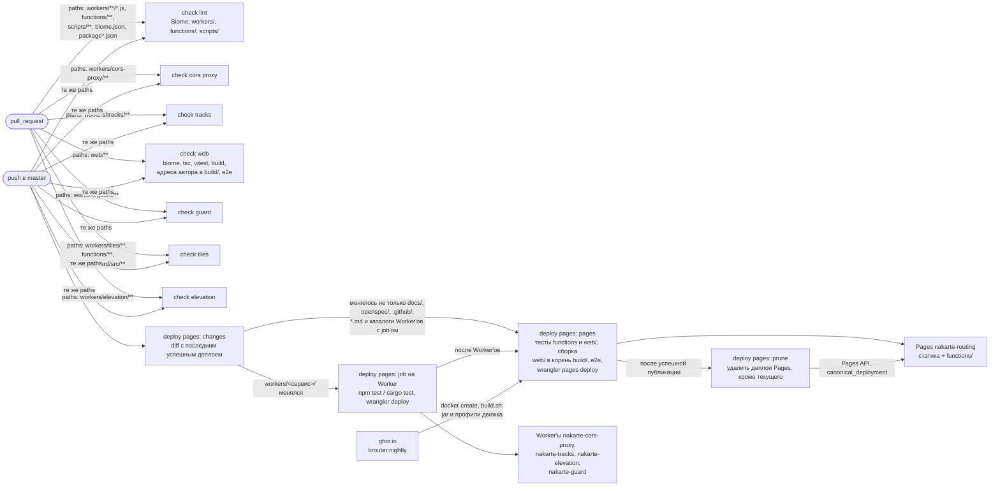
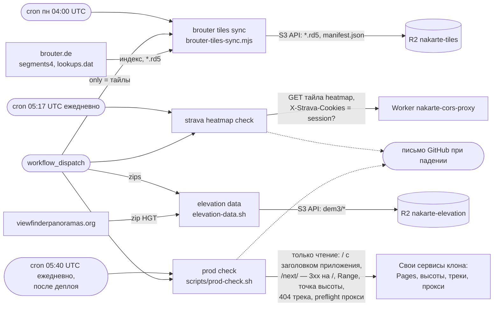

# CI/CD и данные

Уровень выше: [общая схема](README.md#общая-схема), блок ⑦.

Все workflow лежат в [.github/workflows/](../../.github/workflows/). Проверки идут на PR и push в `master`, деплой — на push в `master` только изменённых сервисов, данные заливаются по расписанию или вручную. Поведение деплоя — спека [clone-deploy](../../openspec/specs/clone-deploy/spec.md), синхронизации тайлов — [tile-sync](../../openspec/specs/tile-sync/spec.md); ручной деплой как запасной путь — `AGENTS.md`, [«Публичный клон на Cloudflare»](../../AGENTS.md#публичный-клон-на-cloudflare).

## Проверки и деплой

Job `changes` в [deploy-pages.yml](../../.github/workflows/deploy-pages.yml) сравнивает `HEAD` с коммитом последнего успешного прогона `deploy pages`, а не с предыдущим push: изменения прогона, отменённого новым push (`cancel-in-progress`) или упавшего, выкатит следующий. Ручной запуск, правка самого workflow или неизвестная база — выкатывается всё; правка других workflow, `docs/`, `openspec/` и `*.md` Pages не выкатывает. Job каждого Worker'а гоняет тесты сервиса и деплоит его; `pages` идёт после них и не идёт, если деплой Worker'а упал. Job `prune` после каждой успешной публикации, в том числе когда Worker'ы пропущены, удаляет все деплои Pages, кроме текущего, и только если текущий собран из коммита прогона: старый деплой отвечал бы по `<хеш>.nakarte-routing.pages.dev` со своими функциями, без новых лимитов. Откат Pages — revert и push. Шаги `pages`: тесты Pages Functions → файлы движка из образа (`build.sh`) → приложение из `web/`: `npm ci` и Chromium Playwright, `npm test`, `npm run build` (`vite build --mode clone` в корень `build/`, плагин `engineFiles` кладёт туда jar и профили движка; ключ Google — только этому шагу) → проверка, что файлы движка в сборке → e2e по этой сборке → проверка бандла на адреса автора ([protection.md](protection.md)) → публикация Pages. Проверки `check-<сервис>` деплой не ждёт: job каждого Worker'а и `pages` гоняют нужные тесты сами. Ту же проверку бандла до merge делает `check web` (`../build`).

Тайлы BRouter (`workers/tiles`) отдельным Worker'ом не деплоятся: их код подключён как Pages Function [functions/tiles](../../functions/tiles/[[path]].js) и уходит с Pages; [workers/tiles/wrangler.toml](../../workers/tiles/wrangler.toml) нужен только локальному `wrangler dev`.

## Данные и мониторинг

| Workflow | Когда | Что делает | Куда |
|---|---|---|---|
| `check lint` | PR и push с изменениями в `workers/**/*.js`, `functions/`, `scripts/`, `biome.json`, корневых `package.json` и `package-lock.json` | `npm run lint` из корня: Biome по корневому `biome.json`, только линтер | — |
| `check cors proxy`, `check tracks`, `check guard`, `check tiles` | PR и push с изменениями в каталоге сервиса (`check tiles` — ещё и в `functions/` и `workers/guard/src/`) | `vitest` в `workerd` | — |
| `check web` | PR и push с изменениями в `web/` и `scripts/check-no-author-hosts.mjs` | `biome ci`, `tsc -b`, Vitest (unit в Node и browser mode в Chromium), сборка в `build/`, проверка `build/` на адреса автора, Playwright e2e против `vite preview` | — |
| `check elevation` | PR и push с изменениями в `workers/elevation/` | `cargo fmt`, `clippy` (и под wasm32), `cargo test`, `npm test` в `workerd` | — |
| `deploy pages` | push в `master` (изменённые сервисы), вручную (всё) | тесты сервиса, сборка `web/` и деплой; после Pages — удаление старых деплоев Pages и `prod check` (job `smoke`) | Pages, Worker'ы |
| `brouter tiles sync` | понедельник 04:00 UTC, вручную | инкрементальная синхронизация тайлов | R2 `nakarte-tiles` |
| `elevation data` | вручную | перепаковка HGT в `dem3/*` | R2 `nakarte-elevation` |
| `strava heatmap check` | ежедневно 05:17 UTC, вручную | тайл heatmap через прокси, падает без `session` | — |
| `prod check` | ежедневно 05:40 UTC, после деплоя (job `smoke`), вручную | `scripts/prod-check.sh`: приложение на `/`, редирект `/next/` на `/`, свои сервисы клона отвечают; только чтение | — |

Workflow `elevation tiles` (архив тайлов высот z0–9) удалён вместе с тайлами высот — [elevation.md](elevation.md#тайлы-высот-выведены). Расписания GitHub запускает только из ветки по умолчанию. Workflow с записью в Cloudflare и R2 ограничены форком условием `github.repository == 'sergeycw/nakarte'`.

## Секреты

| Секрет | Где хранится | Кто использует | Права |
|---|---|---|---|
| `CLOUDFLARE_API_TOKEN` | GitHub | шаги `wrangler` и `prune` в `deploy pages` | Account API token «nakarte deploy»: Pages Write, Editor на `nakarte-cors-proxy`, `nakarte-tracks`, `nakarte-elevation`, `nakarte-guard`; без R2 |
| `CLOUDFLARE_ACCOUNT_ID` | GitHub | шаги `wrangler` и `prune` в `deploy pages` | — |
| `GOOGLE_MAPS_API_KEY` | GitHub, необязательный | шаг `web build` в `deploy pages`, переменная `VITE_GOOGLE_MAPS_API_KEY`; без секрета — пустой ключ, режим без ключа | ограничения ключа в Google Cloud (ключ попадает в бандл) |
| `R2_ACCESS_KEY_ID`, `R2_SECRET_ACCESS_KEY` | GitHub | `elevation data`, `brouter tiles sync` (S3 API R2) | Bucket Item Write на `nakarte-elevation` и `nakarte-tiles` |
| `STRAVA_SESSION`, `STRAVA_COOKIES` | секреты Worker'а `nakarte-cors-proxy` | прокси ([cors-proxy.md](cors-proxy.md)) | — |

Секреты передаются только шагам, которые их используют (`env` шага, а не job'а): установка зависимостей, тесты и сборка идут без них. Во всех workflow действия закреплены полным SHA, `wrangler` в шагах с токеном — точной версией из переменной `WRANGLER` (requirement «Секреты только у шагов публикации», [clone-deploy](../../openspec/specs/clone-deploy/spec.md)). Все секреты заводит владелец, агент токены не вводит. Права токенов и порядок заведения — `AGENTS.md`, [«Публичный клон на Cloudflare»](../../AGENTS.md#публичный-клон-на-cloudflare) и [«Сервис высот»](../../AGENTS.md#сервис-высот-workerselevation); утечка и сужение прав — [security-аудит](../../openspec/research/security-audit.md), п. 5 и «Шаги владельца».

## Сверено по

[.github/workflows/](../../.github/workflows/) (все двенадцать файлов), [scripts/brouter-tiles-sync.mjs](../../scripts/brouter-tiles-sync.mjs), [workers/elevation/scripts/](../../workers/elevation/scripts/), [scripts/prod-check.sh](../../scripts/prod-check.sh), [experiments/wasm/cheerpj/build.sh](../../experiments/wasm/cheerpj/build.sh), [web/vite/engine-files.ts](../../web/vite/engine-files.ts), [functions/tiles](../../functions/tiles/[[path]].js), [workers/tiles/wrangler.toml](../../workers/tiles/wrangler.toml).
