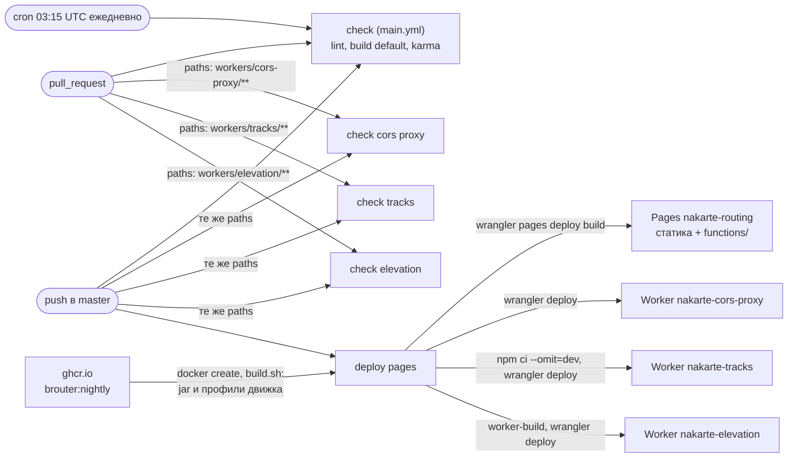
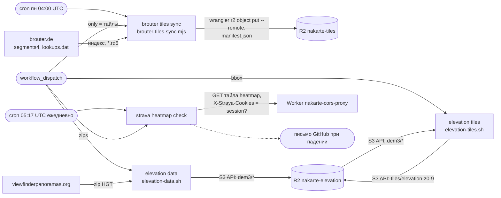

# CI/CD и данные

Уровень выше: [общая схема](README.md#общая-схема), блок ⑦.

Все workflow лежат в [.github/workflows/](../../.github/workflows/). Проверки идут на PR и push в `master`, деплой — на каждый push в `master`, данные заливаются по расписанию или вручную. Поведение деплоя — спека [clone-deploy](../../openspec/specs/clone-deploy/spec.md), синхронизации тайлов — [tile-sync](../../openspec/specs/tile-sync/spec.md); ручной деплой как запасной путь — `AGENTS.md`, [«Публичный клон на Cloudflare»](../../AGENTS.md#публичный-клон-на-cloudflare).

## Проверки и деплой

Шаги `deploy pages` по порядку ([deploy-pages.yml](../../.github/workflows/deploy-pages.yml)): шаблон секретов → ключ Google из секрета → `yarnpkg` → файлы движка из образа → `npm run build` с `NAKARTE_TARGET=clone` → проверка, что файлы движка в сборке → проверка бандла на адреса автора ([protection.md](protection.md)) → публикация Pages → три Worker'а. Упал шаг — дальше не идёт; новый push отменяет текущий прогон (`cancel-in-progress`). Деплой выкатывает все Worker'ы на каждый push, фильтра по путям у него нет.

Тайлы BRouter (`workers/tiles`) отдельным Worker'ом не деплоятся: их код подключён как Pages Function [functions/tiles](../../functions/tiles/[[path]].js) и уходит с Pages; [workers/tiles/wrangler.toml](../../workers/tiles/wrangler.toml) нужен только локальному `wrangler dev`.

## Данные и мониторинг

| Workflow | Когда | Что делает | Куда |
|---|---|---|---|
| `check` ([main.yml](../../.github/workflows/main.yml)) | PR, push в `master`, ежедневно 03:15 UTC | lint, сборка default, karma в Firefox 52 ESR, Firefox latest, Chrome | — |
| `check cors proxy`, `check tracks` | PR и push с изменениями в каталоге сервиса | `vitest` в `workerd` | — |
| `check elevation` | PR и push с изменениями в `workers/elevation/` | `cargo fmt`, `clippy` (и под wasm32), `cargo test`, `npm test` в `workerd` | — |
| `deploy pages` | push в `master`, вручную | сборка клона и деплой | Pages, три Worker'а |
| `brouter tiles sync` | понедельник 04:00 UTC, вручную | инкрементальная синхронизация тайлов | R2 `nakarte-tiles` |
| `elevation data` | вручную | перепаковка HGT в `dem3/*` | R2 `nakarte-elevation` |
| `elevation tiles` | вручную, после обновления `dem3/` | архив тайлов z0–9 | R2 `nakarte-elevation` |
| `strava heatmap check` | ежедневно 05:17 UTC, вручную | тайл heatmap через прокси, падает без `session` | — |

Расписания GitHub запускает только из ветки по умолчанию. Workflow с записью в Cloudflare и R2 ограничены форком условием `github.repository == 'sergeycw/nakarte'`.

## Секреты

| Секрет | Где хранится | Кто использует | Права |
|---|---|---|---|
| `CLOUDFLARE_API_TOKEN` | GitHub | `deploy pages`, `brouter tiles sync` | Pages Edit, Workers Scripts Edit, Workers R2 Storage Edit |
| `CLOUDFLARE_ACCOUNT_ID` | GitHub | `deploy pages`, `brouter tiles sync` | — |
| `GOOGLE_MAPS_API_KEY` | GitHub, необязательный | `deploy pages` (подставляется в `src/secrets.js`) | ограничения ключа в Google Cloud |
| `R2_ACCESS_KEY_ID`, `R2_SECRET_ACCESS_KEY` | GitHub | `elevation data`, `elevation tiles` | Object Read & Write только на `nakarte-elevation` |
| `STRAVA_SESSION`, `STRAVA_COOKIES` | секреты Worker'а `nakarte-cors-proxy` | прокси ([cors-proxy.md](cors-proxy.md)) | — |

Все секреты заводит владелец, агент токены не вводит. Права токенов и порядок заведения — `AGENTS.md`, [«Публичный клон на Cloudflare»](../../AGENTS.md#публичный-клон-на-cloudflare) и [«Сервис высот»](../../AGENTS.md#сервис-высот-workerselevation); утечка и сужение прав — backlog, пункт «Security-аудит клона».

## Сверено по

[.github/workflows/](../../.github/workflows/) (все девять файлов), [scripts/brouter-tiles-sync.mjs](../../scripts/brouter-tiles-sync.mjs), [workers/elevation/scripts/](../../workers/elevation/scripts/), [experiments/wasm/cheerpj/build.sh](../../experiments/wasm/cheerpj/build.sh), [functions/tiles](../../functions/tiles/[[path]].js), [workers/tiles/wrangler.toml](../../workers/tiles/wrangler.toml).
