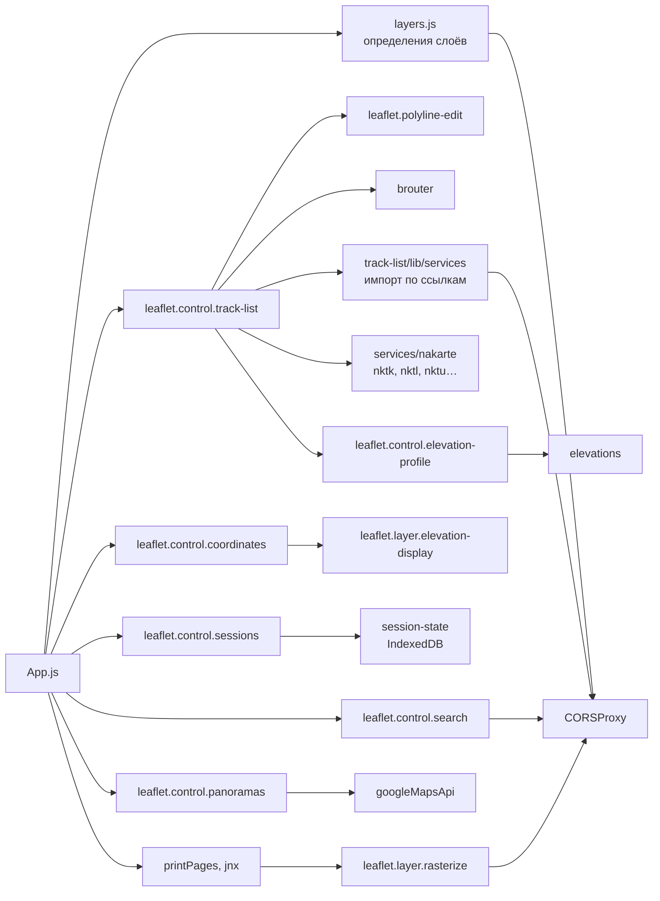
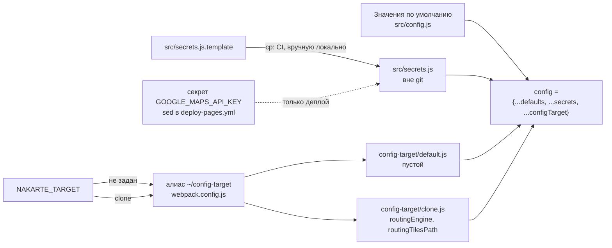

# Клиент

Уровень выше: [общая схема](README.md#общая-схема), блок ①.

SPA на Leaflet + knockout из апстрима, собирается webpack. Точка входа — [src/index.js](../../src/index.js), карта и контролы собираются в [src/App.js](../../src/App.js). Обзор системы — [README.md](README.md).

## Основные модули

Какие модули `src/lib/` подключает приложение и куда они ходят по сети. Показаны модули с собственной логикой или сетью; вспомогательные (`leaflet.control.commons`, `notifications`, `safe-localstorage`, `contextmenu` и т. п.) опущены.

| Модуль | Куда ходит | Подробности |
|---|---|---|
| `brouter` | серверный BRouter или движок CheerpJ | [routing.md](routing.md) |
| `leaflet.polyline-edit` | — | [route-editor.md](route-editor.md) |
| `track-list` и `services/nakarte` | `tracksStorageServer` | [track-storage.md](track-storage.md) |
| `track-list/lib/services` | сайты треков через `CORSProxy` | [cors-proxy.md](cors-proxy.md); что не работает — backlog, «Отложено» |
| `elevations`, `elevation-display` | `elevationsServer`, `elevationTileUrl` | [elevation.md](elevation.md) |
| `session-state` | IndexedDB браузера | [route-editor.md](route-editor.md) |
| `leaflet.control.search` | photon.komoot.io напрямую, mapy.cz и ссылки через `CORSProxy` | [providers/](../../src/lib/leaflet.control.search/providers/) |
| `leaflet.control.panoramas` | Maps JavaScript API Google | спеки [clone-hosting](../../openspec/specs/clone-hosting/spec.md) («Только Google Street View в панорамах», «Street View без ключа без режима разработки») |
| `layers.js`, `leaflet.layer.rasterize` | тайловые провайдеры напрямую; слои с `noCors` и печать — через `CORSProxy` | [layers.js](../../src/layers.js) |

## Как собираются адреса сервисов

`config` — один объект, который читают все модули. Он склеивается из трёх источников, и каждый следующий перебивает предыдущий ([config.js](../../src/config.js)):

- В `src/config.js` — адреса своих Worker'ов, общие для всех сборок, и `routingEngine: 'server'`.
- `src/secrets.js` в CI копируется из шаблона ([main.yml](../../.github/workflows/main.yml), [deploy-pages.yml](../../.github/workflows/deploy-pages.yml)); в шаблоне только `google: ''`. Локальный файл может перебить любое поле — подвох из `AGENTS.md`, [«Запуск»](../../AGENTS.md#запуск).
- `config-target` перебивает всё. Сейчас клон отличается двумя ключами: `routingEngine: 'browser'` и `routingTilesPath: '/tiles/'`. Правило, что туда кладётся, — `AGENTS.md`, [«Свои бэкенды вместо `*.nakarte.me`»](../../AGENTS.md#свои-бэкенды-вместо-nakarteme) и [«Апстрим»](../../AGENTS.md#апстрим).

| Ключ | Кто читает | Значение в клоне |
|---|---|---|
| `CORSProxyUrl` | `CORSProxy`, `index.js` (preconnect) | `https://nakarte-cors-proxy.nakarte-routing.workers.dev/` |
| `wikimapiaTilesBaseUrl` | `layers.js` | `${CORSProxyUrl}wikimapia/` |
| `tracksStorageServer` | `track-list`, `services/nakarte`, `index.js` | `https://nakarte-tracks.nakarte-routing.workers.dev` |
| `elevationsServer` | `elevations`, `index.js` | `https://nakarte-elevation.nakarte-routing.workers.dev/` |
| `elevationTileUrl` | `App.js` → `leaflet.control.coordinates` | `${elevationsServer}tiles/{z}/{x}/{y}` |
| `routingEngine` | `brouter` | `'browser'` (по умолчанию `'server'`) |
| `routingServer` | `brouter` | `http://localhost:17777`, не используется |
| `routingTilesPath` | `brouter/browser-engine.js` | `'/tiles/'` (по умолчанию `'/brouter-wasm/segments4/'`) |
| `googleApiUrl` | `googleMapsApi`, `panoramas/lib/google/keyless.js` | `…/maps/api/js?v=3&key=` + `secrets.google` |
| `eventsLogUrl`, `sentryDSN` | `logging`, `index.js` | пустые |

## Сверено по

[src/config.js](../../src/config.js), [src/config-target/](../../src/config-target/), [src/secrets.js.template](../../src/secrets.js.template), [webpack/webpack.config.js](../../webpack/webpack.config.js), [src/App.js](../../src/App.js), [src/index.js](../../src/index.js), импорты модулей в [src/lib/](../../src/lib/) (`grep -rnoE "config\.[A-Za-z]+" src`).
