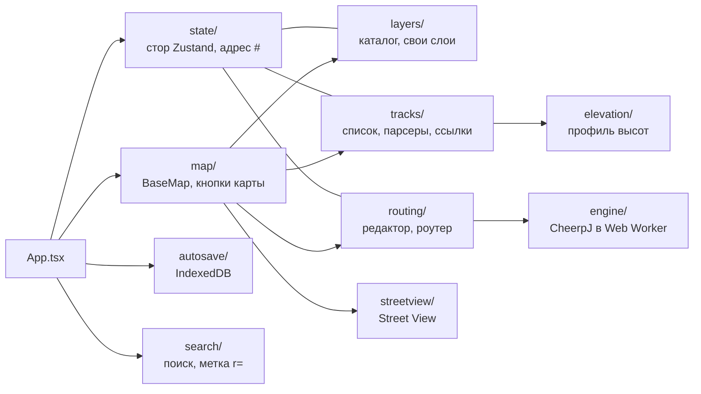
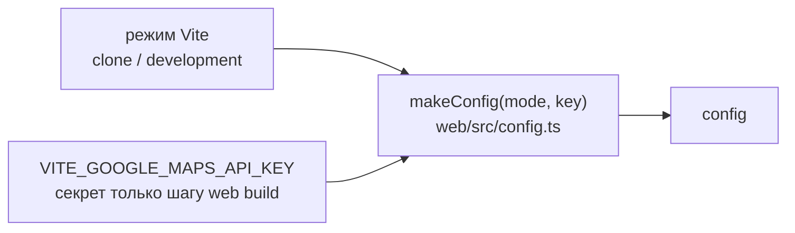

# Клиент

Уровень выше: [общая схема](README.md#общая-схема), блок ①.

Одностраничное приложение в [web/](../../web/): React 19, MapLibre GL JS 6 через `@vis.gl/react-maplibre`, shadcn/ui на Base UI и Tailwind 4, состояние — Zustand, сборка — Vite. Открывается по `https://nakarte-routing.pages.dev/`; `/next/` (адрес до переключения) отвечает редиректом на тот же путь от корня ([web/public/_redirects](../../web/public/_redirects)). Точка входа — [main.tsx](../../web/src/main.tsx), корень — [App.tsx](../../web/src/App.tsx). Старый клиент автора (Leaflet, knockout, webpack) удалён в change `switch-to-web-app`; почему так и как переносили — [ресёрч нового UI](../../openspec/research/new-ui.md) и архивы changes 1–9 из его списка.

## Основные модули

Каталоги `web/src/` с собственной логикой или сетью. Каждый держит чистые модули без React и карты (разбор, модель, запросы) отдельно от компонентов; компоненты и карта связаны через стор. Вспомогательные (`components/ui` shadcn, `lib/`, `test/`) опущены.

| Каталог | Куда ходит | Подробности |
|---|---|---|
| `state/` | `location.hash`, `localStorage` | `hash.ts` — параметры адреса старого клиента (`m=`, `l=`, `r=`, `n2=` …), `sync.ts` — стор ↔ адрес ↔ `localStorage`; спека [web-client](../../openspec/specs/web-client/spec.md) |
| `layers/` | тайловые провайдеры напрямую; Strava, Tsvetkov (`Mt`) и свои слои с флагом прокси — через `corsProxyUrl` | спека [map-layers](../../openspec/specs/map-layers/spec.md), [cors-proxy.md](cors-proxy.md) |
| `tracks/` | `tracksStorageServer` (`nktl=`, «Copy link»), сайты треков через `corsProxyUrl` | [track-storage.md](track-storage.md), спеки [tracks](../../openspec/specs/tracks/spec.md), [track-files](../../openspec/specs/track-files/spec.md) |
| `routing/` | серверный BRouter (`routingServer`) или `engine/` | [route-editor.md](route-editor.md), [routing.md](routing.md) |
| `engine/` | рантайм CheerpJ с CDN Leaning Technologies, `/brouter-wasm/` и `routingTilesPath` того же origin | [routing.md](routing.md), спека [browser-routing-engine](../../openspec/specs/browser-routing-engine/spec.md) |
| `autosave/` | IndexedDB `nakarte-web`; один раз читает `sessions` старого клиента | архивы `add-web-autosave`, `switch-to-web-app` |
| `elevation/` | `elevationsServer` (профиль, GPX с высотами, высота для Google Earth) | [elevation.md](elevation.md) |
| `search/` | mapy.cz и короткие ссылки через `corsProxyUrl`, photon.komoot.io напрямую | спека [map-search](../../openspec/specs/map-search/spec.md) |
| `streetview/` | Maps JavaScript API Google, тайлы покрытия | спека [street-view](../../openspec/specs/street-view/spec.md) |
| `map/` | — (внешние карты открываются в новой вкладке) | спека [web-client](../../openspec/specs/web-client/spec.md) |

Связь «клик по карте» общая для редактора, метки и Street View — `routing/MapEditor.tsx` (`onClick`); на телефоне долгое нажатие открывает меню на карте ([route-editor.md](route-editor.md)).

## Как собираются адреса сервисов

Один модуль [config.ts](../../web/src/config.ts): `makeConfig(mode, googleMapsApiKey)` от режима Vite. Режим `clone` (`vite build --mode clone`, скрипт `build` и деплой) включает движок в браузере; любой другой (`npm run dev`) — серверный BRouter из `docker-compose.yml`. Ключ Google — переменная сборки `VITE_GOOGLE_MAPS_API_KEY`: деплой передаёт секрет `GOOGLE_MAPS_API_KEY` только шагу сборки ([deploy-pages.yml](../../.github/workflows/deploy-pages.yml)), без него — режим без ключа.

| Поле | Кто читает | Значение в клоне |
|---|---|---|
| `corsProxyUrl` | `layers/`, `tracks/`, `search/` | `https://nakarte-cors-proxy.nakarte-routing.workers.dev/` |
| `tracksStorageServer` | `tracks/` | `https://nakarte-tracks.nakarte-routing.workers.dev` |
| `elevationsServer` | `elevation/`, `map/` (Google Earth) | `https://nakarte-elevation.nakarte-routing.workers.dev/` |
| `routingEngine` | `routing/`, `App.tsx` | `'browser'` (иначе `'server'`) |
| `routingEngineRuntimeUrl` | `engine/` | загрузчик CheerpJ 4.3 с `cjrtnc.leaningtech.com` |
| `routingServer` | `routing/` | `http://localhost:17777`, в клоне не используется |
| `routingTilesPath` | `engine/` | `'/tiles/'` (иначе `'/brouter-wasm/segments4/'`) |
| `googleMapsApiKey` | `streetview/` | секрет или пустая строка |

## Сборка и раздача

`vite build --mode clone` кладёт приложение и стенд движка (`engine-bench.html`) в корень `build/`; плагин `engineFiles` ([vite/engine-files.ts](../../web/vite/engine-files.ts)) докладывает файлы движка в `build/brouter-wasm/`, файлы `web/public/` (`_redirects`, `favicon.ico`) копируются как есть. `build/` публикуется в Pages вместе с [functions/](../../functions/) ([ci-cd.md](ci-cd.md)).

## Сверено по

[web/src/config.ts](../../web/src/config.ts), [web/src/App.tsx](../../web/src/App.tsx), [web/vite.config.ts](../../web/vite.config.ts), каталоги `web/src/*/` (`grep -rhoE "config\.[A-Za-z]+" web/src`, `grep -rl "fetch(" web/src`), [deploy-pages.yml](../../.github/workflows/deploy-pages.yml) — `master` после change `switch-to-web-app`.
