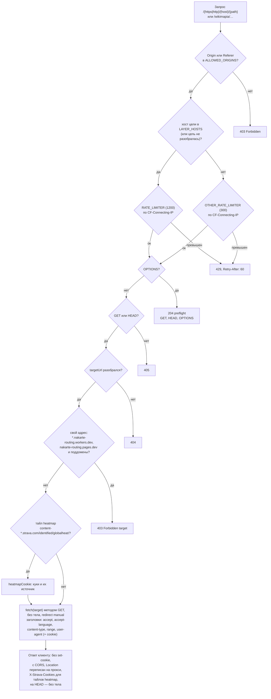
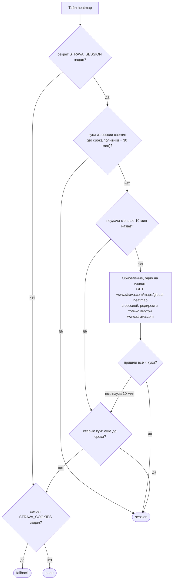
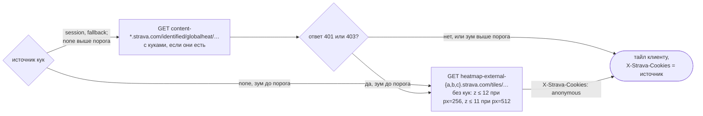

# CORS-прокси и Strava heatmap

Уровень выше: [общая схема](README.md#общая-схема), блок ④.

Worker `nakarte-cors-proxy` ([workers/cors-proxy](../../workers/cors-proxy/)) повторяет протокол авторского `proxy.nakarte.me`: клиент приписывает к адресу прокси исходный URL (`viaCorsProxy` в [catalog.ts](../../web/src/layers/catalog.ts): `https://host/…` → `<прокси>https/host/…`), прокси забирает ответ и отдаёт его с CORS-заголовками. Через него идут импорт треков по ссылкам ([sources.ts](../../web/src/tracks/sources.ts), `proxied`), поиск mapy.cz ([mapycz.ts](../../web/src/search/mapycz.ts)) и раскрытие коротких ссылок ([links.ts](../../web/src/search/links.ts)), слои Tsvetkov (`Mt`) и Strava heatmap, свои слои с флагом прокси. Маршрут `/wikimapia/` и растеризацию слоёв для печати использовал старый клиент; в приложении `web/` их нет, `/wikimapia/` уходит в change `retire-old-client-services`.

Поведение — спека [cors-proxy](../../openspec/specs/cors-proxy/spec.md); лимиты — [protection.md](protection.md).

## Обработка запроса

Код — `fetch` и `proxy` в [index.js](../../workers/cors-proxy/src/index.js). Почему прокси только читает, закрывает свои адреса и делит лимит по роли хоста — архив [restrict-cors-proxy](../../openspec/changes/archive/2026-10-08-restrict-cors-proxy/design.md). Почему `HEAD` уходит как `GET`, зачем пересылается `User-Agent` и откуда origin karma `localhost:9876` — архив [drop-author-services](../../openspec/changes/archive/2026-10-08-drop-author-services/design.md).

## Куки Strava heatmap

Тайлы `content-*.strava.com/identified/globalheat/` CloudFront отдаёт только с подписанными куками вошедшего аккаунта. Прокси держит их сам, клиент про них не знает. Источник кук для тайла уходит в заголовок `X-Strava-Cookies` ([strava.js](../../workers/cors-proxy/src/strava.js), `heatmapCookie`).

Что прокси делает с источником:

- Секреты Worker'а `STRAVA_SESSION` и `STRAVA_COOKIES` заводит владелец скриптами [strava-session-secret.mjs](../../scripts/strava-session-secret.mjs) и [strava-heatmap-secret.mjs](../../scripts/strava-heatmap-secret.mjs); сессия и куки не попадают в журнал и не уходят никуда, кроме `www.strava.com` и тайлов heatmap.
- Раз в день workflow `strava heatmap check` запрашивает тайл через прокси и падает, если `X-Strava-Cookies` не `session` ([ci-cd.md](ci-cd.md)).
- Решения — архив [add-strava-heatmap-refresh](../../openspec/changes/archive/2026-10-08-add-strava-heatmap-refresh/design.md) и [add-strava-anonymous-fallback](../../openspec/changes/archive/2026-10-08-add-strava-anonymous-fallback/design.md); порядок обновления секрета и диагностика — `AGENTS.md`, [«Публичный клон на Cloudflare»](../../AGENTS.md#публичный-клон-на-cloudflare); срок сессии — backlog, «Отложено».

## Сверено по

[workers/cors-proxy/src/index.js](../../workers/cors-proxy/src/index.js), [workers/cors-proxy/src/strava.js](../../workers/cors-proxy/src/strava.js), [workers/cors-proxy/wrangler.toml](../../workers/cors-proxy/wrangler.toml), [web/src/layers/catalog.ts](../../web/src/layers/catalog.ts) (`viaCorsProxy`), [web/src/layers/custom.ts](../../web/src/layers/custom.ts), [web/src/tracks/sources.ts](../../web/src/tracks/sources.ts), [web/src/search/mapycz.ts](../../web/src/search/mapycz.ts), [web/src/search/links.ts](../../web/src/search/links.ts), [strava-heatmap-check.yml](../../.github/workflows/strava-heatmap-check.yml).
