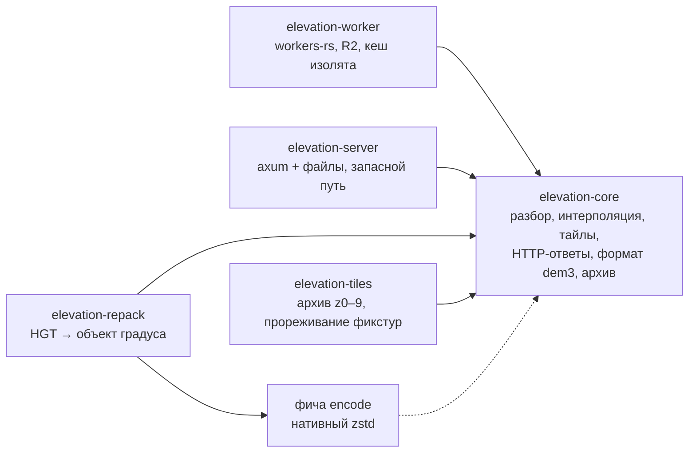
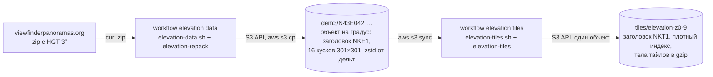
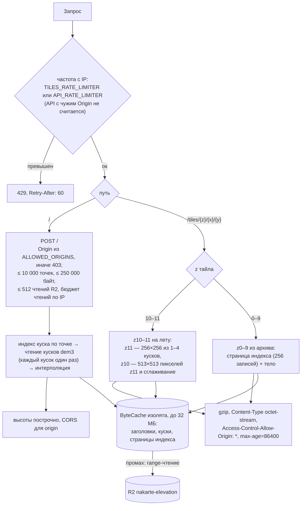

# Сервис высот

Уровень выше: [общая схема](README.md#общая-схема), блок ⑥.

Worker `nakarte-elevation` ([workers/elevation](../../workers/elevation/)) отвечает на два запроса: API высот (`POST /`, список точек → высоты) для профиля трека и экспорта, и тайлы высот (`GET /tiles/{z}/{x}/{y}`) для высоты и уклона под курсором. Данные и арифметика — как у автора (DEM 3″ viewfinderpanoramas). Поведение — спеки [elevation-api](../../openspec/specs/elevation-api/spec.md) и [elevation-tiles](../../openspec/specs/elevation-tiles/spec.md); решения — архив [add-elevation-api](../../openspec/changes/archive/2026-10-07-add-elevation-api/design.md) и [add-elevation-tiles](../../openspec/changes/archive/2026-10-07-add-elevation-tiles/design.md); сборка, проверки и подвохи — `AGENTS.md`, [«Сервис высот»](../../AGENTS.md#сервис-высот-workerselevation).

## Крейты Rust-воркспейса

- `core` без ввода-вывода: источник данных — трейт `Source` с чтением диапазона байт объекта ([lib.rs](../../workers/elevation/core/src/lib.rs)); каждый адаптер подставляет свой: R2 в `worker`, файлы в `server`.
- Распаковка кусков в wasm — чистый Rust (`ruzstd`), упаковка — нативный `zstd` за фичей `encode`, поэтому она включена только у `repack` ([Cargo.toml](../../workers/elevation/repack/Cargo.toml)).
- `worker` собирается `worker-build` в `worker/build/index.js` (`[build]` в [wrangler.toml](../../workers/elevation/wrangler.toml)).

## Данные в R2 `nakarte-elevation`

Формат объектов — [format.rs](../../workers/elevation/core/src/format.rs), [grid.rs](../../workers/elevation/core/src/grid.rs) и [archive.rs](../../workers/elevation/core/src/archive.rs); почему такой — design `add-elevation-api` («Формат: объект на градус, куски автора») и `add-elevation-tiles` («Формат архива: плотный индекс»). Workflow и токены — [ci-cd.md](ci-cd.md).

## Запрос к Worker'у

- Расчёт пикселя один для генератора архива и для Worker'а ([render.rs](../../workers/elevation/core/src/render.rs), [tile.rs](../../workers/elevation/core/src/tile.rs)), поэтому уровни из архива и на лету согласованы.
- Cache API на `*.workers.dev` не работает, поэтому кеш — в памяти изолята; после перезаливки архива Worker передеплоить (кеш держит страницы старого индекса).
- Клиент: API — [web/src/elevation/api.ts](../../web/src/elevation/api.ts) (профиль высот, GPX с высотами, высота для Google Earth; атрибуция `elevationsAttribution` в [config.ts](../../web/src/config.ts)), [client.md](client.md). У тайлов клиента больше нет: их показывал старый клиент под кнопкой координат, сами тайлы и архив уходят в change `retire-old-client-services`.

## Сверено по

[workers/elevation/Cargo.toml](../../workers/elevation/Cargo.toml) и `Cargo.toml` крейтов, [core/src/http.rs](../../workers/elevation/core/src/http.rs) (`handle`, `rate_group`, `respond_tile`), [core/src/request.rs](../../workers/elevation/core/src/request.rs) (`MAX_POINTS`, `MAX_BODY_BYTES`), [core/src/tile.rs](../../workers/elevation/core/src/tile.rs) (`LIVE_MIN_ZOOM`, `MAX_ZOOM`), [core/src/archive.rs](../../workers/elevation/core/src/archive.rs), [worker/src/lib.rs](../../workers/elevation/worker/src/lib.rs), [wrangler.toml](../../workers/elevation/wrangler.toml), [scripts/](../../workers/elevation/scripts/), [elevation-data.yml](../../.github/workflows/elevation-data.yml), [elevation-tiles.yml](../../.github/workflows/elevation-tiles.yml).
