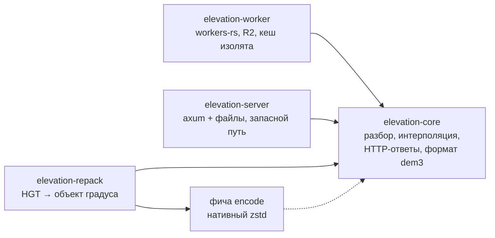
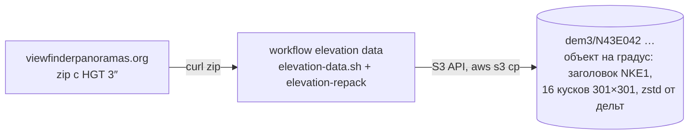
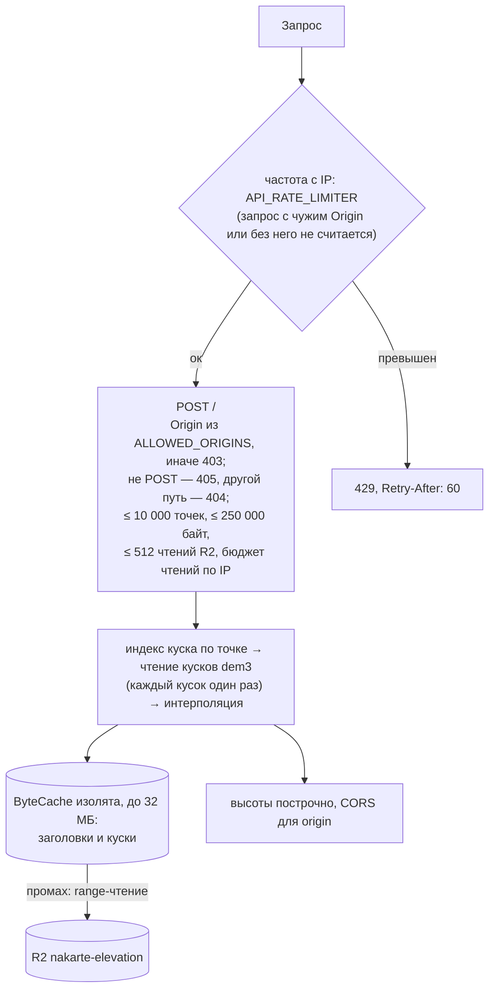

# Сервис высот

Уровень выше: [общая схема](README.md#общая-схема), блок ⑥.

Worker `nakarte-elevation` ([workers/elevation](../../workers/elevation/)) отвечает на один запрос: API высот (`POST /`, список точек → высоты) для профиля трека и экспорта. Данные и арифметика — как у автора (DEM 3″ viewfinderpanoramas). Поведение — спека [elevation-api](../../openspec/specs/elevation-api/spec.md); решения — архив [add-elevation-api](../../openspec/changes/archive/2026-10-07-add-elevation-api/design.md); сборка, проверки и подвохи — `AGENTS.md`, [«Сервис высот»](../../AGENTS.md#сервис-высот-workerselevation). Тайлов высот больше нет — раздел [«Тайлы высот выведены»](#тайлы-высот-выведены).

## Крейты Rust-воркспейса

- `core` без ввода-вывода: источник данных — трейт `Source` с чтением диапазона байт объекта ([lib.rs](../../workers/elevation/core/src/lib.rs)); каждый адаптер подставляет свой: R2 в `worker`, файлы в `server`.
- Распаковка кусков в wasm — чистый Rust (`ruzstd`), упаковка — нативный `zstd` за фичей `encode`, поэтому она включена только у `repack` ([Cargo.toml](../../workers/elevation/repack/Cargo.toml)).
- `worker` собирается `worker-build` в `worker/build/index.js` (`[build]` в [wrangler.toml](../../workers/elevation/wrangler.toml)).

## Данные в R2 `nakarte-elevation`

Формат объектов — [format.rs](../../workers/elevation/core/src/format.rs) и [grid.rs](../../workers/elevation/core/src/grid.rs); почему такой — design `add-elevation-api` («Формат: объект на градус, куски автора»). Workflow и токены — [ci-cd.md](ci-cd.md). Архив тайлов высот `tiles/elevation-z0-9` в R2 остаётся до решения владельца, Worker его не читает.

## Запрос к Worker'у

- Cache API на `*.workers.dev` не работает, поэтому кеш — в памяти изолята.
- Клиент: API — [web/src/elevation/api.ts](../../web/src/elevation/api.ts) (профиль высот, GPX с высотами, высота для Google Earth; атрибуция `elevationsAttribution` в [config.ts](../../web/src/config.ts)), [client.md](client.md).

## Тайлы высот выведены

Тайлы высот (`GET /tiles/{z}/{x}/{y}`: z0–9 из архива, z10–11 на лету) показывал только старый клиент — высоту и уклон под курсором. Change [retire-old-client-services](../../openspec/changes/archive/2026-10-09-retire-old-client-services/design.md) их убрал: нет маршрута `/tiles/`, счётчика `TILES_RATE_LIMITER` (`namespace_id` `1001` свободен), расчёта тайлов в ядре, генератора архива `elevation-tiles` и workflow `elevation tiles`. `GET /tiles/…` теперь обычный запрос к API: без `Origin` — `403`, с разрешённым — `405`. Архив `tiles/elevation-z0-9` в R2 остаётся до решения владельца, Worker его не читает. Как тайлы были устроены — архив [add-elevation-tiles](../../openspec/changes/archive/2026-10-07-add-elevation-tiles/design.md).

## Сверено по

[workers/elevation/Cargo.toml](../../workers/elevation/Cargo.toml) и `Cargo.toml` крейтов, [core/src/http.rs](../../workers/elevation/core/src/http.rs) (`handle`, `counts_toward_limit`), [core/src/request.rs](../../workers/elevation/core/src/request.rs) (`MAX_POINTS`, `MAX_BODY_BYTES`), [worker/src/lib.rs](../../workers/elevation/worker/src/lib.rs), [wrangler.toml](../../workers/elevation/wrangler.toml), [scripts/](../../workers/elevation/scripts/), [elevation-data.yml](../../.github/workflows/elevation-data.yml).
