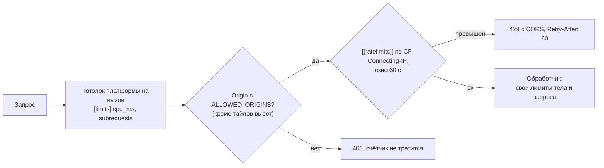
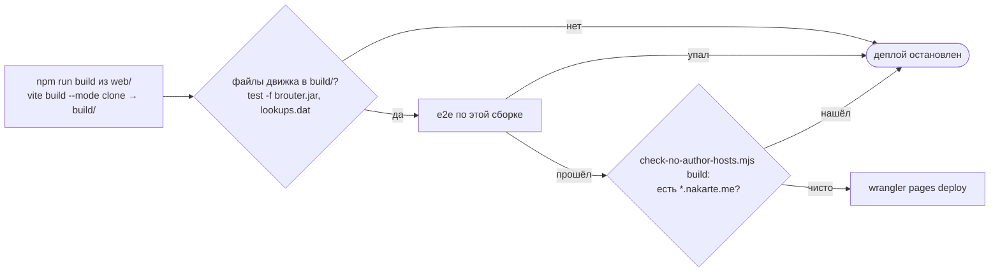

# Защита и лимиты

Уровень выше: [общая схема](README.md#общая-схема), блок «Cloudflare» и ⑦.

Что ограничивает нагрузку и расходы на Cloudflare и что не даёт клону сходить в инфраструктуру автора. Поведение — спеки [worker-limits](../../openspec/specs/worker-limits/spec.md) и [clone-deploy](../../openspec/specs/clone-deploy/spec.md) («Бандл без адресов автора»), CORS каждого сервиса — в его спеке; решения и цифры — архив [add-worker-limits](../../openspec/changes/archive/2026-10-07-add-worker-limits/design.md); правила для нового счётчика — `AGENTS.md`, [«Свои бэкенды вместо `*.nakarte.me`»](../../AGENTS.md#свои-бэкенды-вместо-nakarteme).

## Порядок проверок в Worker'е

Без `CF-Connecting-IP` (локальный `wrangler dev`, тесты) частота не ограничивается. Version URL (`<версия>-<worker>.nakarte-routing.workers.dev`) выключены `preview_urls = false`, а у Pages деплой оставляет только текущий деплой (job `prune`, [ci-cd.md](ci-cd.md)): старая версия со старыми лимитами обходила бы новые. Привязку rate limiting Pages Functions не поддерживают, поэтому их счётчик живёт в отдельном закрытом Worker'е — design [limit-pages-functions](../../openspec/changes/archive/2026-10-08-limit-pages-functions/design.md). `Origin` подделывается любым `curl`, поэтому CORS защищает пользователей, а не бюджет: от злоупотреблений защищают частота и потолки.

| Точка входа | CORS | Частота за 60 с (`namespace_id`) | Потолок на вызов | Лимит запроса | Где |
|---|---|---|---|---|---|
| `nakarte-cors-proxy` | `Origin` или `Referer` из `ALLOWED_ORIGINS`, с `credentials`; в списке остались порты старого клиента и karma `localhost:9876` (уходят в change `retire-old-client-services`) | хосты слоёв — 1200 (`1004`), остальные — 300 (`1007`) | `cpu_ms = 500`, `subrequests = 50` | только `GET`/`HEAD` без тела; свои адреса — `403` | [wrangler.toml](../../workers/cors-proxy/wrangler.toml), [index.js](../../workers/cors-proxy/src/index.js) |
| `nakarte-tracks` | только `Origin` из `ALLOWED_ORIGINS`, с `credentials` | 60 (`1003`), из них записей 10 (`1006`) | `cpu_ms = 500`, `subrequests = 10` | тело ≤ 2 МиБ, только алфавит ссылки | [wrangler.toml](../../workers/tracks/wrangler.toml), [index.js](../../workers/tracks/src/index.js) |
| `nakarte-elevation`, `POST /` | только `Origin` из `ALLOWED_ORIGINS`, с `credentials` | 60 (`1002`); бюджет чтений R2 — 32 единицы по 64 чтения (`1005`) | `cpu_ms = 10000`, `subrequests = 1100` | ≤ 10 000 точек, ≤ 250 000 байт, ≤ 512 чтений R2 (градусы + куски), иначе `413` | [wrangler.toml](../../workers/elevation/wrangler.toml), [http.rs](../../workers/elevation/core/src/http.rs), [request.rs](../../workers/elevation/core/src/request.rs) |
| `nakarte-elevation`, `/tiles/` | `*` без проверки `Origin` | 600 (`1001`) | как у API | z ≤ 11 | то же |
| Pages Functions `tiles`, `brouter-wasm` | тот же origin, заголовков CORS нет | 1200 на обе (`1008`), счётчик — Worker `nakarte-guard` по service binding `GUARD`; без привязки или при её сбое не ограничивается | лимиты Pages по умолчанию | — | [functions/](../../functions/), [workers/guard](../../workers/guard/) |

Почему у прокси лимит выше остальных — design `add-worker-limits`, «Частота — привязка Workers Rate Limiting»; потолок и бюджет чтений R2 у API высот — design [limit-elevation-reads](../../openspec/changes/archive/2026-10-08-limit-elevation-reads/design.md): привязка считает вызовы без веса, поэтому запрос тратит вызов на каждые 64 чтения после проверки потолка. Угрозы с ценой худшего сценария и что ещё не защищено — [security-аудит](../../openspec/research/security-audit.md#итог).

## Проверка бандла на адреса автора

Скрипт ([check-no-author-hosts.mjs](../../scripts/check-no-author-hosts.mjs)) обходит текстовые файлы сборки без `.map` и падает на любом буквальном `*.nakarte.me`: исключения для строк-метаданных старого клиента (`<title>`, `creator` в GPX, имя файла JNX, текст уведомления сессий) ушли вместе с ним (design [switch-to-web-app](../../openspec/changes/switch-to-web-app/design.md)). До merge ту же проверку делает `check web` ([ci-cd.md](ci-cd.md)). Почему проверка статическая — design [drop-author-services](../../openspec/changes/archive/2026-10-08-drop-author-services/design.md), «Статическая проверка бандла»; что заменило сервисы автора — [README.md](README.md#что-больше-не-используется-от-nakarteme).

## Сверено по

[workers/cors-proxy/wrangler.toml](../../workers/cors-proxy/wrangler.toml), [workers/tracks/wrangler.toml](../../workers/tracks/wrangler.toml), [workers/elevation/wrangler.toml](../../workers/elevation/wrangler.toml), [workers/cors-proxy/src/index.js](../../workers/cors-proxy/src/index.js), [workers/tracks/src/index.js](../../workers/tracks/src/index.js), [workers/elevation/core/src/http.rs](../../workers/elevation/core/src/http.rs), [workers/elevation/worker/src/lib.rs](../../workers/elevation/worker/src/lib.rs), [functions/](../../functions/), [scripts/check-no-author-hosts.mjs](../../scripts/check-no-author-hosts.mjs), [deploy-pages.yml](../../.github/workflows/deploy-pages.yml), [check-web.yml](../../.github/workflows/check-web.yml).
