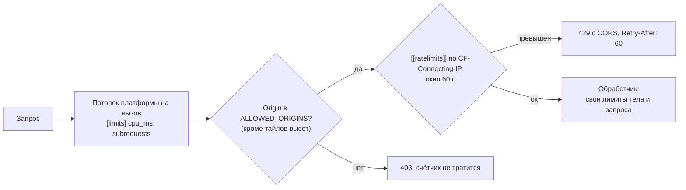
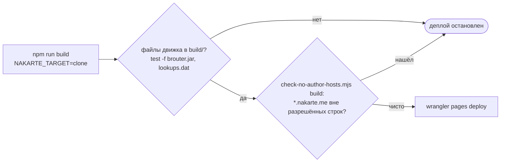

# Защита и лимиты

Что ограничивает нагрузку и расходы на Cloudflare и что не даёт клону сходить в инфраструктуру автора. Поведение — спеки [worker-limits](../../openspec/specs/worker-limits/spec.md) и [clone-deploy](../../openspec/specs/clone-deploy/spec.md) («Бандл без адресов автора»), CORS каждого сервиса — в его спеке; решения и цифры — архив [add-worker-limits](../../openspec/changes/archive/2026-10-07-add-worker-limits/design.md); правила для нового счётчика — `AGENTS.md`, [«Свои бэкенды вместо `*.nakarte.me`»](../../AGENTS.md#свои-бэкенды-вместо-nakarteme).

## Порядок проверок в Worker'е

Без `CF-Connecting-IP` (локальный `wrangler dev`, тесты) частота не ограничивается. `Origin` подделывается любым `curl`, поэтому CORS защищает пользователей, а не бюджет: от злоупотреблений защищают частота и потолки.

| Точка входа | CORS | Частота за 60 с (`namespace_id`) | Потолок на вызов | Лимит запроса | Где |
|---|---|---|---|---|---|
| `nakarte-cors-proxy` | `Origin` или `Referer` из `ALLOWED_ORIGINS`, с `credentials`; в списке и karma `localhost:9876` | 1200 (`1004`) | `cpu_ms = 500`, `subrequests = 50` | — | [wrangler.toml](../../workers/cors-proxy/wrangler.toml), [index.js](../../workers/cors-proxy/src/index.js) |
| `nakarte-tracks` | только `Origin` из `ALLOWED_ORIGINS`, с `credentials` | 60 (`1003`) | `cpu_ms = 500`, `subrequests = 10` | тело ≤ 10 МиБ | [wrangler.toml](../../workers/tracks/wrangler.toml), [index.js](../../workers/tracks/src/index.js) |
| `nakarte-elevation`, `POST /` | только `Origin` из `ALLOWED_ORIGINS`, с `credentials` | 60 (`1002`) | `cpu_ms = 10000`, `subrequests` не задан | ≤ 10 000 точек, ≤ 250 000 байт | [wrangler.toml](../../workers/elevation/wrangler.toml), [http.rs](../../workers/elevation/core/src/http.rs) |
| `nakarte-elevation`, `/tiles/` | `*` без проверки `Origin` | 600 (`1001`) | как у API | z ≤ 11 | то же |
| Pages Functions `tiles`, `brouter-wasm` | тот же origin, заголовков CORS нет | нет | лимиты Pages по умолчанию | — | [functions/](../../functions/) |

Почему у `subrequests` нет потолка в `nakarte-elevation` и почему у прокси лимит выше остальных — design `add-worker-limits`, «Потолок на вызов» и «Частота — привязка Workers Rate Limiting». Что ещё не защищено (Pages Functions, рост `nakarte-tracks`, прокси как открытый прокси, права токенов) — backlog, пункт «Security-аудит клона».

## Проверка бандла на адреса автора

Скрипт ([check-no-author-hosts.mjs](../../scripts/check-no-author-hosts.mjs)) обходит текстовые файлы сборки без `.map` и разрешает только строки-метаданные: `<title>`, `creator` в GPX, имя файла JNX, текст уведомления сессий. Почему так — design [drop-author-services](../../openspec/changes/archive/2026-10-08-drop-author-services/design.md), «Статическая проверка бандла»; что заменило сервисы автора — [README.md](README.md#что-больше-не-используется-от-nakarteme).

## Сверено по

[workers/cors-proxy/wrangler.toml](../../workers/cors-proxy/wrangler.toml), [workers/tracks/wrangler.toml](../../workers/tracks/wrangler.toml), [workers/elevation/wrangler.toml](../../workers/elevation/wrangler.toml), [workers/cors-proxy/src/index.js](../../workers/cors-proxy/src/index.js), [workers/tracks/src/index.js](../../workers/tracks/src/index.js), [workers/elevation/core/src/http.rs](../../workers/elevation/core/src/http.rs), [workers/elevation/worker/src/lib.rs](../../workers/elevation/worker/src/lib.rs), [functions/](../../functions/), [scripts/check-no-author-hosts.mjs](../../scripts/check-no-author-hosts.mjs), [deploy-pages.yml](../../.github/workflows/deploy-pages.yml).
