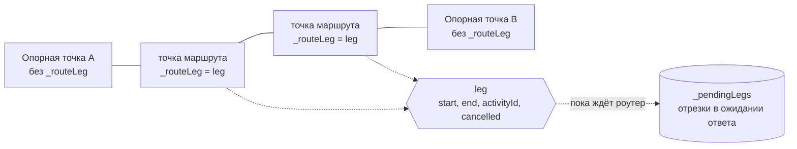
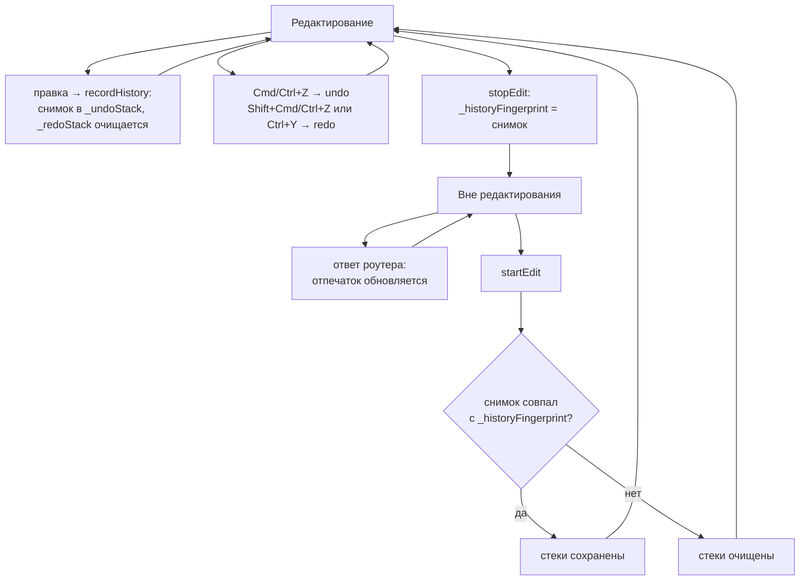
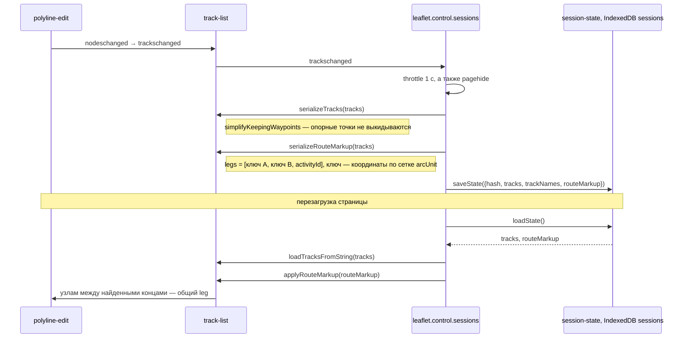

# Редактор маршрута

Уровень выше: [общая схема](README.md#общая-схема), блок ①.

Как линия трека хранит опорные точки и точки маршрута, как отрезки прокладываются и отменяются, где живёт история и как разметка маршрута переживает перезагрузку. Поведение — спека [route-editing](../../openspec/specs/route-editing/spec.md); подвохи редактора и модель узлов — `AGENTS.md`, [«Где код роутинга»](../../AGENTS.md#где-код-роутинга).

## Модель линии

Линия — обычный `L.Polyline` с миксином `L.Polyline.EditMixin` ([polyline-edit](../../src/lib/leaflet.polyline-edit/index.js)), узлы — `L.LatLng` в `_latlngs`. Отрезок маршрута — объект `leg`, общий для всех его промежуточных узлов.

- Маркеры точек маршрута скрыты классом `line-editor-node-marker-hidden`, видны и двигаются только опорные.
- `routeBetween(start, end, activityId)` помечает узлы между опорными, кладёт `leg` в `_pendingLegs`, рисует спиннер и зовёт `router.route` ([routing.md](routing.md)). Ответ `_applyLegRoute` применяет, только если `leg` не отменён и узлы между концами всё ещё его; иначе ответ устарел и отбрасывается.
- Перетаскивание опорной точки (`rerouteAroundNode`), удаление (`removeWaypoint`) и вставка отменяют ожидающие отрезки у этой точки и прокладывают соседние заново с той же активностью.
- Ошибка роутера превращается в пустой массив точек: отрезок остаётся прямым.

## История

- Снимок (`_takeSnapshot`) — JSON узлов в диапазоне `_fixedNodesRange()` с `activityId` у точек маршрута и список ожидающих отрезков; `_restoreSnapshot` пересоздаёт `leg` и заново прокладывает ожидавшие.
- Глубина — `_historyLimit = 100`. Хоткеи ловятся на `keydown` (`onKeyDownHistory`), причина — `AGENTS.md`, «Где код роутинга».
- Кнопок undo/redo в UI нет — backlog, «Редактор и активности».

## Разметка маршрута между перезагрузками

Сессия хранит треки как строку nktk, а она несёт только геометрию. Какие отрезки были маршрутом и с какой активностью, хранится рядом — в `routeMarkup`.

- Номера узлов между перезагрузками не стабильны (округление nktk и упрощение линии), поэтому пары ищутся по ключам координат `routeMarkupKey` ([track-list.js](../../src/lib/leaflet.control.track-list/track-list.js)).
- Ссылки и экспорт несут только геометрию, разметку — только сессия (спека [route-editing](../../openspec/specs/route-editing/spec.md), «Ссылки и экспорт несут только геометрию»).
- Почему порядок `_drawingDirection` и `spliceLatLngs` важен для сохранения — архив [fix-route-markup-after-reload](../../openspec/changes/archive/2026-10-07-fix-route-markup-after-reload/design.md).

## Сверено по

[src/lib/leaflet.polyline-edit/index.js](../../src/lib/leaflet.polyline-edit/index.js) (`routeBetween`, `_applyLegRoute`, `rerouteAroundNode`, `removeWaypoint`, `_takeSnapshot`, `_restoreSnapshot`, `recordHistory`, `startEdit`, `stopEdit`), [track-list.js](../../src/lib/leaflet.control.track-list/track-list.js) (`routeMarkupKey`, `simplifyKeepingWaypoints`, `serializeRouteMarkup`, `applyRouteMarkup`), [src/lib/leaflet.control.sessions/index.js](../../src/lib/leaflet.control.sessions/index.js), [src/lib/session-state/index.js](../../src/lib/session-state/index.js).
