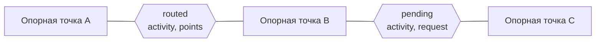

# Редактор маршрута

Уровень выше: [общая схема](README.md#общая-схема), блок ①; клиент — [client.md](client.md).

Как линия трека хранит опорные точки и отрезки маршрута, как отрезки прокладываются и отменяются, где живёт история и как разметка маршрута переживает перезагрузку и ссылку. Поведение — спеки [route-editing](../../openspec/specs/route-editing/spec.md) и [routing](../../openspec/specs/routing/spec.md); решения — архивы [add-web-route-editor](../../openspec/changes/archive/2026-10-09-add-web-route-editor/design.md), [add-web-autosave](../../openspec/changes/archive/2026-10-09-add-web-autosave/design.md), [add-web-line-tools](../../openspec/changes/archive/2026-10-09-add-web-line-tools/design.md). Код — [web/src/routing/](../../web/src/routing/).

## Модель линии

Линия редактора — опорные точки и отрезки между ними, а не плоский массив узлов с меткой у каждого, как было у редактора старого клиента. Данные неизменяемые: правка даёт новую линию ([line.ts](../../web/src/routing/line.ts)).



- Отрезок (`Leg`) — `straight` (прямая), `routed` (точки маршрута между опорными), `pending` (ждёт роутер под номером запроса) или `failed` (не проложен: прямая с пометкой и тостом, активность остаётся для повтора).
- В треке линия лежит геометрией (`segments`) и разметкой (`routes`: номера опорных точек и состояния отрезков без точек) — `toSegment` и `fromSegment`. Разметку несут автосохранение и ссылка `nktk` (необязательное поле отрезка версии 4), файлы GPX и KML — только геометрию.
- Упрощение линии (`simplifyRouted`) упрощает каждый проложенный отрезок отдельно вместе с его опорными концами, номера пересчитываются: опорные точки не пропадают.

## Правки, запросы и устаревшие ответы

Редактор одной линии без карты — [editor.ts](../../web/src/routing/editor.ts): `addWaypoint`, `moveWaypoint`, `insertWaypoint`, `removeWaypoint`, `shortcut`, `reverse`, `undo`, `redo`.

```mermaid
sequenceDiagram
    participant UI as MapEditor (карта)
    participant ED as editing.ts (стор)
    participant RE as editor.ts
    participant RO as router.ts
    participant EN as engine.ts / серверный BRouter

    UI->>ED: клик, перетаскивание
    ED->>RE: правка
    RE->>RE: новая линия, прежняя — в историю; отрезки с активностью → pending(request)
    RE->>RO: route(from, to, activity, signal)
    RO->>EN: запрос в очередь движка
    EN-->>RO: точки или ошибка
    RO-->>RE: ответ
    RE->>RE: request ещё в линии? применить: отбросить
    RE->>ED: onChange(line) → трек в сторе
```

- Ответ применяется, только если его номер запроса ещё лежит в линии; иначе отрезок перетащили, удалили или отменили, и ответ молча отбрасывается. Запрос, чей отрезок ушёл из линии, отменяется `AbortController`'ом; очередь самих расчётов — в движке ([routing.md](routing.md)).
- [editing.ts](../../web/src/routing/editing.ts) связывает редакторы со стором без React: редактор живёт дольше редактирования (дожидается ответов, хранит историю) и лежит по массиву точек отрезка, который последним записал в трек; внешнее изменение отрезка (разворот, удаление, импорт) даёт другой массив, и такой редактор выбрасывается.
- Инструменты линии — Cut, Join, Shortcut, разворот — чистые функции над `RouteLine` ([line-tools.ts](../../web/src/routing/line-tools.ts)); меню на карте и долгое нажатие на телефоне — [MapMenu.tsx](../../web/src/routing/MapMenu.tsx), [MapEditor.tsx](../../web/src/routing/MapEditor.tsx).

## История

- Каждая правка кладёт прежнюю линию в стек undo (до 100 шагов, `HISTORY_LIMIT`) и очищает redo; ответ роутера в историю не пишется — undo отменяет правку, а не приход маршрута.
- Снимок из истории с ожидающими отрезками запрашивает их заново.
- Вставка точки на отрезок и перетаскивание сразу после — один шаг истории.
- Хоткеи — на `keydown` (на macOS, пока зажат Cmd, браузер не присылает `keyup` других клавиш); кнопки undo/redo — в панели редактора.

## Разметка между перезагрузками

```mermaid
sequenceDiagram
    participant ST as стор (tracks)
    participant AS as autosave.ts
    participant DB as IndexedDB nakarte-web
    participant OLD as IndexedDB sessions (старый клиент)

    ST->>AS: изменение tracks
    AS->>DB: запись {segments: Float64Array, routes} (сразу; пока запись в полёте — одна следующая)
    Note over ST,DB: перезагрузка страницы
    AS->>DB: load()
    alt своя запись есть
        DB-->>AS: треки с разметкой
    else своей записи нет
        AS->>OLD: последняя сессия (один раз)
        OLD-->>AS: строки nktk + legs по ключам сетки
        AS->>AS: legs → routes, упрощение как у ссылки
    end
    AS->>ST: треки в начало списка
```

- Координаты пишутся точно, без округления nktk: номера разметки верны как есть.
- Сессия старого клиента подхватывается, только если своей записи нет; база `sessions` не меняется (архив `switch-to-web-app`).

## Сверено по

[web/src/routing/](../../web/src/routing/) (`line.ts`, `editor.ts`, `editing.ts`, `line-tools.ts`, `router.ts`), [web/src/autosave/](../../web/src/autosave/) (`autosave.ts`, `saved.ts`, `idb.ts`, `legacy-session.ts`) — `master` после change `switch-to-web-app`.
