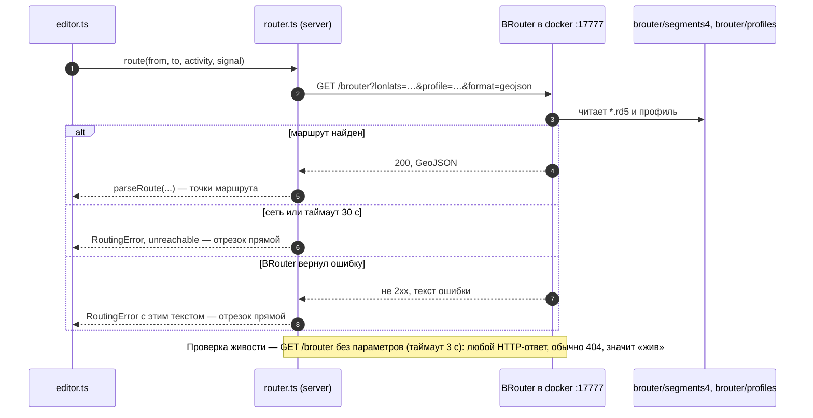
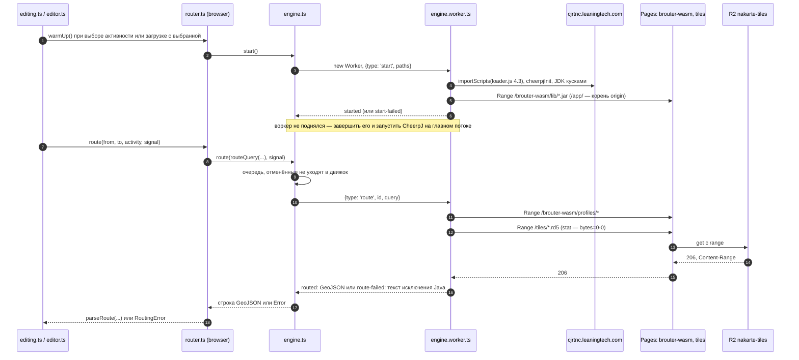

# Прокладка отрезка

Уровень выше: [общая схема](README.md#общая-схема), блоки ②, ③ и ⑧.

Как отрезок между двумя опорными точками превращается в точки маршрута. Движок выбирает ключ `routingEngine` в [config.ts](../../web/src/config.ts) по режиму Vite ([client.md](client.md)): режим `clone` — `'browser'`, BRouter на CheerpJ в браузере; остальные — `'server'`, BRouter в docker. Оба движка спрятаны за интерфейсом `Router` в [router.ts](../../web/src/routing/router.ts), и для редактора результат одинаковый: точки отрезка или `RoutingError`.

Поведение — спеки [routing](../../openspec/specs/routing/spec.md) и [browser-routing-engine](../../openspec/specs/browser-routing-engine/spec.md). Код — [web/src/routing/](../../web/src/routing/) (запрос и ответ — `brouter.ts`, роутер — `router.ts`) и [web/src/engine/](../../web/src/engine/); как редактор зовёт роутер и отбрасывает устаревшие ответы — [route-editor.md](route-editor.md).

## Общая часть

1. Редактор ([route-editor.md](route-editor.md)) на каждый отрезок в состоянии `pending` вызывает `router.route(from, to, activity, signal)`; отрезок, который правка убрала, отменяется через `AbortSignal`, и отказ с `signal.reason` редактор молча отбрасывает.
2. `routeQuery` в [brouter.ts](../../web/src/routing/brouter.ts) собирает строку запроса: `lonlats` (долгота приведена к [−180, 180]), `profile` по активности, `profile:<переменная>` из `params` активности, `alternativeidx=0`, `format=geojson`. Строка одна для сервера и движка.
3. Ответ — GeoJSON; `parseRoute` сдвигает его в копию мира точки `from`, упрощает линию допуском импорта (≈ 2.4 м) и отбрасывает концы ближе 20 м к опорным точкам. Пустой маршрут — ошибка `no route found`.
4. `RoutingError` с `unreachable` (сервер не ответил, движок не запустился) красит кнопку и один раз на переход «работал → упал» показывает предупреждение; остальные ошибки — уведомление `Routing failed`. Отрезок остаётся прямым (спека [routing](../../openspec/specs/routing/spec.md), «Ошибка прокладки даёт прямой отрезок», «Недоступный роутер»). Перепроверка живости — `isReachable` при открытии меню прокладки.

Отсутствие тайла BRouter называет `datafile … not found`, `RoutingError` подменяет текст на `no routing data for this area` для обоих движков (архив [explain-missing-routing-data](../../openspec/changes/archive/2026-10-07-explain-missing-routing-data/proposal.md)).

## Серверный BRouter

Таймаут запроса — 30 с, без повторов. Адрес сервера — `routingServer` в [config.ts](../../web/src/config.ts), BRouter поднимает [docker-compose.yml](../../docker-compose.yml). Свои профили, тег образа и подвохи compose — `AGENTS.md`, [«Запуск»](../../AGENTS.md#запуск).

## Движок в браузере

Отличия от сервера: движок — синглтон `getEngine()` в [engine.ts](../../web/src/engine/engine.ts), один на страницу, создаётся лениво и запускается заранее; запросы идут в очередь по одному; файлы BRouter читаются по HTTP Range с того же origin. CheerpJ живёт в классическом Web Worker ([engine.worker.ts](../../web/src/engine/engine.worker.ts)), и главный поток во время запуска и расчёта свободен. Если воркер не поднялся, в той же попытке движок запускается на главном потоке ([backends.ts](../../web/src/engine/backends.ts), `mainThreadBackend`). Решения и замеры — архив [spike-engine-in-worker](../../openspec/changes/archive/2026-10-08-spike-engine-in-worker/design.md).

- Состояние движка (`idle`, `loading`, `ready`, `failed`) видит кнопка прокладки через `router.status()` и `subscribe`. Сбой запуска не залипает: следующий маршрут пробует запустить движок снова, а пока статус `failed`, роутер считается недоступным (`EngineStartError` → `RoutingError` с `unreachable`).
- Начатый расчёт CheerpJ не прервать: отменённый запрос сразу получает отказ, а следующий ждёт, пока движок освободится.
- Пути движка — `enginePaths` в [cheerpj-router.ts](../../web/src/engine/cheerpj-router.ts): classpath `brouter-patch.jar:brouter.jar:wasm-router.jar` из `/app/brouter-wasm/lib/`, профили — `/app/brouter-wasm/profiles/`, тайлы — `/app` + `routingTilesPath` (`/tiles/` в клоне). Обвязка CheerpJ повторена в воркере и в `cheerpj-router.ts`: классический воркер в dev Vite ничего не импортирует.

Как устроено чтение `/app/` и зачем патчи:

- CheerpJ видит `/app/` как файлы от корня origin страницы. Каталогов там нет, размер — из `Content-Range` ответа на `Range: bytes=0-0`, поэтому статика без `206` не годится: Range для jar и профилей отвечает [functions/brouter-wasm](../../functions/brouter-wasm/[[path]].js), для тайлов — [functions/tiles](../../functions/tiles/[[path]].js) поверх [workers/tiles/src/index.js](../../workers/tiles/src/index.js). Jar и профили кладёт в `build/brouter-wasm/` плагин `engineFiles` сборки ([engine-files.ts](../../web/vite/engine-files.ts)); dev-сервер и `vite preview` отдают их с Range сами.
- `NodesCache.java` в [patch/](../../experiments/wasm/cheerpj/patch/btools/mapaccess/) обходит проверку каталога сегментов, `OsmNodesMap.java` ловит переполнение стека, которое CheerpJ присылает как `ArithmeticException`. Патчи собираются в `brouter-patch.jar` и стоят первыми в classpath ([build.sh](../../experiments/wasm/cheerpj/build.sh)).
- `WasmRouter` ([WasmRouter.java](../../experiments/wasm/cheerpj/java/WasmRouter.java)) повторяет `RouteServer` BRouter без сокетов.

Подробности и проверенные на практике подвохи — `AGENTS.md`, [«Движок в браузере (CheerpJ)»](../../AGENTS.md#движок-в-браузере-cheerpj). Требования к движку — спека [browser-routing-engine](../../openspec/specs/browser-routing-engine/spec.md): «Один движок на страницу», «Очередь запросов», «Данные движка от корня origin», «Рантайм с CDN Leaning Technologies», «Расчёт маршрута вне главного потока». Стенд замеров — `/engine-bench.html` ([engine-bench.ts](../../web/src/bench/engine-bench.ts)). Откуда берутся тайлы в R2 — [ci-cd.md](ci-cd.md); замеры движка и альтернативы — backlog, «Варианты движка в браузере».

## Сверено по

[web/src/routing/router.ts](../../web/src/routing/router.ts), [web/src/routing/brouter.ts](../../web/src/routing/brouter.ts), [web/src/routing/editing.ts](../../web/src/routing/editing.ts) (`onRouteError`, `setActivity`, `warmUp`, `checkRouter`), [web/src/routing/editor.ts](../../web/src/routing/editor.ts) (`request`), [web/src/engine/](../../web/src/engine/), [web/src/config.ts](../../web/src/config.ts), [web/src/App.tsx](../../web/src/App.tsx) (`createRouter`), [web/vite/engine-files.ts](../../web/vite/engine-files.ts), [functions/](../../functions/), [workers/tiles/src/index.js](../../workers/tiles/src/index.js), [experiments/wasm/cheerpj/build.sh](../../experiments/wasm/cheerpj/build.sh), [docker-compose.yml](../../docker-compose.yml).
