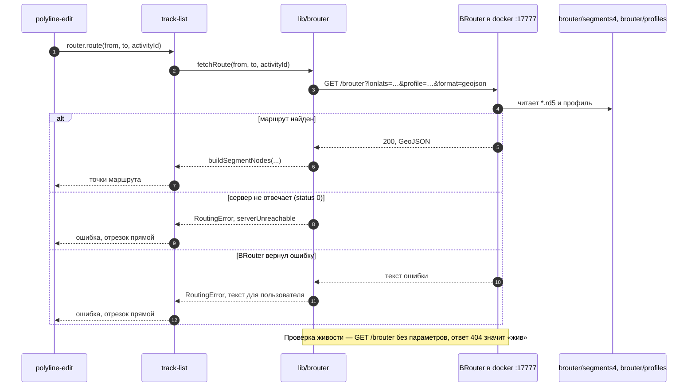
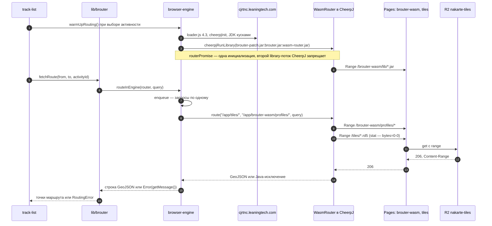
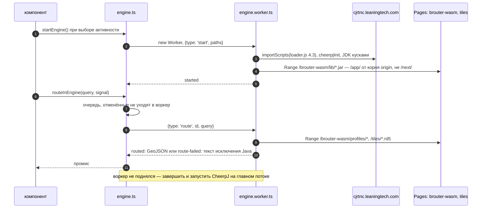

# Прокладка отрезка

Уровень выше: [общая схема](README.md#общая-схема), блоки ②, ③ и ⑧.

Как отрезок между двумя опорными точками превращается в точки маршрута. Движок выбирает ключ `routingEngine` ([client.md](client.md)): `'server'` — BRouter в docker, `'browser'` — тот же BRouter на CheerpJ в странице. Для редактора результат одинаковый: массив `L.LatLng` или `RoutingError`.

Поведение — спеки [routing](../../openspec/specs/routing/spec.md) и [browser-routing-engine](../../openspec/specs/browser-routing-engine/spec.md); где лежит код — `AGENTS.md`, [«Где код роутинга»](../../AGENTS.md#где-код-роутинга).

## Общая часть

1. Редактор ([route-editor.md](route-editor.md)) вызывает `polyline.router.route(from, to, activityId)`; это `routeSegment` в [track-list.js](../../src/lib/leaflet.control.track-list/track-list.js).
2. `fetchRoute` в [lib/brouter/index.js](../../src/lib/brouter/index.js) собирает запрос `buildRouteParams`: `lonlats`, `profile` по активности, `profile:<переменная>` из `params` активности, `alternativeidx=0`, `format=geojson`.
3. Ответ — GeoJSON; `buildSegmentNodes` упрощает линию (допуск `360 / 2^24` градуса) и отбрасывает концы ближе 20 м к опорным точкам.
4. Ошибка с `serverUnreachable` красит кнопку и один раз показывает предупреждение, остальные — уведомление `Routing failed`; отрезок остаётся прямым (спека [routing](../../openspec/specs/routing/spec.md), «Ошибка прокладки даёт прямой отрезок», «Недоступный роутер»).

## Серверный BRouter

Таймаут запроса — 30 с, без повторов. Отсутствие тайла BRouter называет `datafile … not found`, клиент показывает `no routing data for this area` (архив [explain-missing-routing-data](../../openspec/changes/archive/2026-10-07-explain-missing-routing-data/proposal.md)). Свои профили, тег образа и подвохи compose — `AGENTS.md`, [«Запуск»](../../AGENTS.md#запуск).

## Движок в браузере

Отличия от сервера: движок один на страницу и запускается заранее, запросы идут в очередь, а файлы BRouter читаются по HTTP Range с того же origin ([browser-engine.js](../../src/lib/brouter/browser-engine.js)).

Как устроено чтение `/app/` и зачем патчи:

- CheerpJ видит `/app/` как файлы origin страницы. Каталогов там нет, размер — из `Content-Range` ответа на `Range: bytes=0-0`, поэтому статика без `206` не годится: Range для jar и профилей отвечает [functions/brouter-wasm](../../functions/brouter-wasm/[[path]].js), для тайлов — [functions/tiles](../../functions/tiles/[[path]].js) поверх [workers/tiles/src/index.js](../../workers/tiles/src/index.js).
- `NodesCache.java` в [patch/](../../experiments/wasm/cheerpj/patch/btools/mapaccess/) обходит проверку каталога сегментов, `OsmNodesMap.java` ловит переполнение стека, которое CheerpJ присылает как `ArithmeticException`. Патчи собираются в `brouter-patch.jar` и стоят первыми в classpath ([build.sh](../../experiments/wasm/cheerpj/build.sh)).
- `WasmRouter` ([WasmRouter.java](../../experiments/wasm/cheerpj/java/WasmRouter.java)) повторяет `RouteServer` BRouter без сокетов.

Подробности и проверенные на практике подвохи — `AGENTS.md`, [«Движок в браузере (CheerpJ)»](../../AGENTS.md#движок-в-браузере-cheerpj). Требования к движку — спека [browser-routing-engine](../../openspec/specs/browser-routing-engine/spec.md): «Один движок на страницу», «Очередь запросов», «Данные движка с того же origin», «Рантайм с CDN Leaning Technologies». Откуда берутся тайлы в R2 — [ci-cd.md](ci-cd.md); замеры движка и альтернативы — backlog, «Варианты движка в браузере».

### Новое приложение: движок в Web Worker

В `web/` тот же CheerpJ и те же файлы, но CheerpJ живёт в классическом Web Worker, и главный поток страницы во время запуска и расчёта свободен. Очередь и отмена — на стороне страницы, в воркер уходит по одному запросу. Если воркер не поднялся, движок в той же попытке запускается на главном потоке, как в старом клиенте. Решения и замеры — design change `spike-engine-in-worker`; требование — «Расчёт маршрута вне главного потока» в спеке [browser-routing-engine](../../openspec/specs/browser-routing-engine/spec.md).

## Сверено по

[src/lib/brouter/index.js](../../src/lib/brouter/index.js), [src/lib/brouter/browser-engine.js](../../src/lib/brouter/browser-engine.js), [track-list.js](../../src/lib/leaflet.control.track-list/track-list.js) (`routeSegment`, `checkRoutingServer`, `onRoutingActivityChanged`), [functions/](../../functions/), [workers/tiles/src/index.js](../../workers/tiles/src/index.js), [experiments/wasm/cheerpj/build.sh](../../experiments/wasm/cheerpj/build.sh), [docker-compose.yml](../../docker-compose.yml), [src/config-target/clone.js](../../src/config-target/clone.js), [web/src/engine/](../../web/src/engine/), [web/vite/engine-files.ts](../../web/vite/engine-files.ts).
