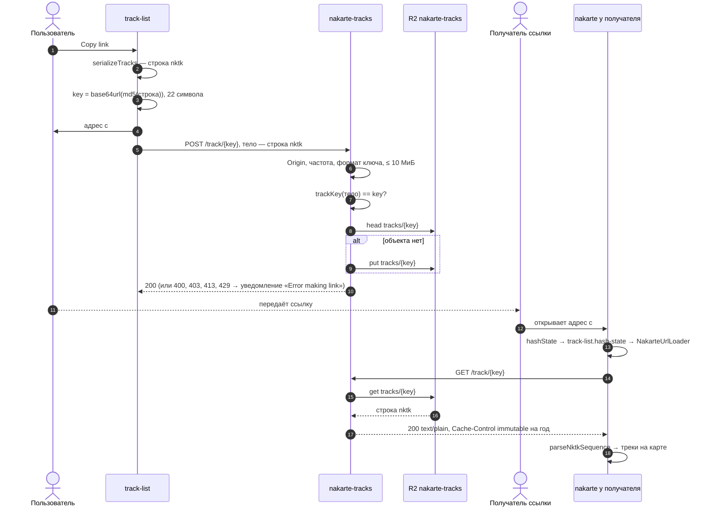

# Хранилище треков: ссылка `nktl=`

Короткая ссылка на треки: в адресе только ключ, сами треки лежат в Worker'е `nakarte-tracks` ([workers/tracks](../../workers/tracks/)) в R2. Контракт повторяет авторский `tracks.nakarte.me`, поэтому клиент не менялся. Поведение — спека [track-storage](../../openspec/specs/track-storage/spec.md); решения — архив [add-track-storage](../../openspec/changes/archive/2026-10-07-add-track-storage/design.md).

## От «Copy link» до открытия

- Ссылка попадает в буфер обмена до ответа сервера: если `POST` не прошёл, пользователь увидит уведомление, но ссылка уже скопирована.
- Ключ — хеш содержимого, поэтому объект неизменяемый, а повторная запись не нужна. Worker считает ключ тем же `blueimp-md5`, что клиент ([key.js](../../workers/tracks/src/key.js)).
- Разметка маршрута в ссылку не попадает: только геометрия ([route-editor.md](route-editor.md)).
- Старые ссылки `nktl=` держатся на этом хранилище, это важно при переименовании Worker'ов — backlog, «Глобальное направление».

## Сверено по

[track-list.js](../../src/lib/leaflet.control.track-list/track-list.js) (`copyTracksLinkToClipboard`, `getLinkToShare`), [track-list.hash-state.js](../../src/lib/leaflet.control.track-list/track-list.hash-state.js), [services/nakarte/index.js](../../src/lib/leaflet.control.track-list/lib/services/nakarte/index.js) (`loadFromTextEncodedTrackId`), [workers/tracks/src/index.js](../../workers/tracks/src/index.js), [workers/tracks/src/key.js](../../workers/tracks/src/key.js), [workers/tracks/wrangler.toml](../../workers/tracks/wrangler.toml).
