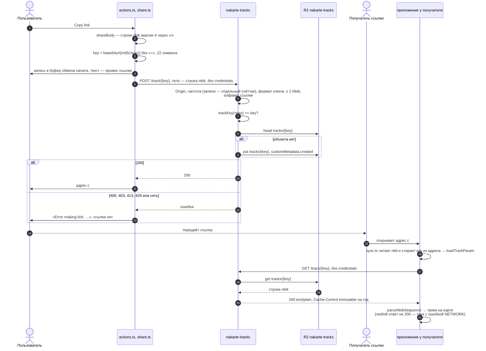

# Хранилище треков: ссылка `nktl=`

Уровень выше: [общая схема](README.md#общая-схема), блок ⑤.

Короткая ссылка на треки: в адресе только ключ, сами треки лежат в Worker'е `nakarte-tracks` ([workers/tracks](../../workers/tracks/)) в R2. Контракт повторяет авторский `tracks.nakarte.me`: тело — те же строки `nktk`, ключ — тот же хеш, поэтому выданные раньше ссылки `nktl=` открываются. Поведение — спека [track-storage](../../openspec/specs/track-storage/spec.md); решения — архив [add-track-storage](../../openspec/changes/archive/2026-10-07-add-track-storage/design.md), клиентская часть — архив [add-web-tracks](../../openspec/changes/archive/2026-10-08-add-web-tracks/design.md).

## От «Copy link» до открытия

- Ссылка попадает в буфер обмена только после `200` хранилища: в буфер уходит промис текста, и если `POST` не прошёл, ссылки у пользователя нет, есть уведомление. Старый клиент отдавал ссылку до ответа сервера — архив [add-web-tracks](../../openspec/changes/archive/2026-10-08-add-web-tracks/design.md), «Ссылка — после ответа хранилища».
- Ключ — хеш содержимого, поэтому объект неизменяемый, а повторная запись не нужна. Worker считает ключ тем же `blueimp-md5`, что клиент ([key.js](../../workers/tracks/src/key.js), `trackKey` в [share.ts](../../web/src/tracks/share.ts)).
- Разметка маршрута попадает в ссылку необязательным полем отрезка в строке `nktk` версии 4 (схема — [nktk.proto](../../web/src/tracks/nktk.proto), [route-editor.md](route-editor.md)); Worker тело не разбирает. Читаются все версии `nktk` от 1 до 4 ([nktk.ts](../../web/src/tracks/nktk.ts)): на них держатся выданные ссылки и объекты хранилища.
- Адрес ссылки — текущий адрес приложения без поиска (`q`, `r`) и без параметров треков, их место занимает `nktl` (`shareLink`).
- Старые ссылки `nktl=` держатся на этом хранилище, это важно при переименовании Worker'ов — backlog, «Глобальное направление».

## Сверено по

[web/src/tracks/share.ts](../../web/src/tracks/share.ts) (`shareBody`, `trackKey`, `shareLink`, `storeTracks`), [web/src/tracks/actions.ts](../../web/src/tracks/actions.ts) (`copyLink`), [web/src/tracks/links.ts](../../web/src/tracks/links.ts) (`fromStorage`, `loadTrackParam`), [web/src/tracks/nktk.ts](../../web/src/tracks/nktk.ts) (`saveNktk`, `parseNktkSequence`), [web/src/state/sync.ts](../../web/src/state/sync.ts), [workers/tracks/src/index.js](../../workers/tracks/src/index.js), [workers/tracks/src/key.js](../../workers/tracks/src/key.js), [workers/tracks/wrangler.toml](../../workers/tracks/wrangler.toml).
